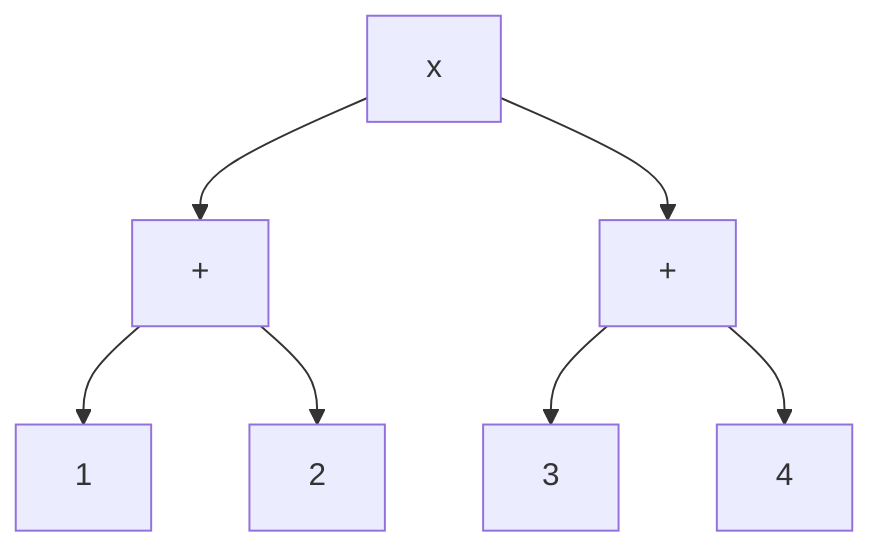

## 链接
[20. 有效的括号](https://programmercarl.com/0020.%E6%9C%89%E6%95%88%E7%9A%84%E6%8B%AC%E5%8F%B7.html)
[1047. 删除字符串中的所有相邻重复项](https://programmercarl.com/1047.%E5%88%A0%E9%99%A4%E5%AD%97%E7%AC%A6%E4%B8%B2%E4%B8%AD%E7%9A%84%E6%89%80%E6%9C%89%E7%9B%B8%E9%82%BB%E9%87%8D%E5%A4%8D%E9%A1%B9.html)
[150. 逆波兰表达式求值](https://programmercarl.com/0150.%E9%80%86%E6%B3%A2%E5%85%B0%E8%A1%A8%E8%BE%BE%E5%BC%8F%E6%B1%82%E5%80%BC.html)

## 知识
### 20. 有效的括号

1. cpp中，将一个个字母存储在stack中，用`stack<int>`或者`stack<char>`都是一样的。若是`stack<int>`，则字符以ascii码的形式存储。
2. 在Linux系统中，cd（change directory）命令用于更改当前工作目录。它确实可以借助栈的概念来理解路径的导航，尤其是处理相对路径时。

   考虑命令`cd a/b/c/../../`，这里我们可以将目录路径视作一个栈的操作序列：

   `cd a`：进入目录a，相当于将a压入栈。
   `cd b`：进入子目录b，相当于将b压入栈中a的上面。
   `cd c`：进入子目录c，相当于将c压入栈中b的上面。
   此时栈的状态为：
   
   ```
   c
   b
   a
   ```
   然后遇到`..`，这代表上一级目录，相当于从栈中弹出最上面的元素。第一个`..`将c弹出。
   栈的状态更新为：
   
   ```
   b
   a
   ```
   第二个`..`将b弹出。
   最终栈的状态为：
   ```
   a
   ```
   所以，最后当前工作目录是a。**在这个过程中，我们可以将每个目录视为栈中的一个元素，每进入一个新的子目录就相当于压入一个元素，而每次使用`..`就相当于弹出一个元素，回到上一级目录**。这就是栈数据结构在文件系统路径解析中的一个应用。

## 初次尝试
### 20. 有效的括号

不知道怎么做，直接看卡尔的讲解视频。

### 1047. 删除字符串中的所有相邻重复项

本题应该是一道用栈解决的经典问题。以输入s = "abbaca"为例，定义一个栈，遍历字符串，遍历到第一个字符时，判断栈顶元素是否与之相同，是，则弹出栈顶元素，否，则插入该字符。对后面的字符也是这样处理的。根据这个思路，我独立写出了如下的代码：
```cpp
class Solution {
public:
    string removeDuplicates(string s) {
        stack<char> st;

        for (int i = 0; i < s.size(); i ++ )
        {
            if (st.empty()) st.push(s[i]);
            else if (s[i] == st.top()) st.pop();
            else st.push(s[i]);
        }
        string out;
        while (st.size())
        {
            out += st.top();
            st.pop();
        }
        reverse(out.begin(), out.end());
        return out;
    }
};
```

需要特别注意：

- 对栈做top操作时需要保证其非空，否则会报访问未知地址，导致程序非法访问内存的错误
- 将栈中的一个个元素弹出并插入到一个字符串中后，需要将字符串颠倒顺序，输出才是正确的顺序

### 150. 逆波兰表达式求值

我看题后，暂时还没有解题思路。先看视频，了解本题的解题思路。

## 实现
### 20. 有效的括号

本题是用栈来解决的经典题目。栈的应用：编译器做词法分析、linux系统的命令。

不匹配的场景共有三个：
1. 多出左括号
2. 括号的类型不匹配
3. 多出右括号

各种不匹配的场景都可被归为以上三类。

如何用栈结构解决三类不匹配的情形？

对1，从字符串的左边向右边遍历，遇到左括号，就将一个对应的右括号加入到栈中。当遍历到字符串的右括号时，若栈顶元素和右括号相同，则弹出栈顶元素。如果字符串遍历完了，但栈不为空，栈中还剩余右括号，就说明字符串中的左括号多了，不匹配。

对2，从左往右遍历字符串，遇到左括号，就在栈中加入一个对应的右括号。遇到右括号，将其与栈顶的元素比较，若不相同，则说明不匹配。

对3，从左往右遍历字符串，遇到左括号，就在栈中加入一个对应的右括号。遇到右括号，将其与栈顶的元素比较，相同则弹出栈顶的元素。若字符串还没遍历完，栈就空了，说明字符串的前面没有左括号与后面的右括号对应，说明多出了右括号，也不匹配。

字符串遍历完之后，栈是空的，就说明全都匹配了。

剪枝：字符串长度为奇数，一定会有不匹配的括号，直接return false即可。

看了卡尔的视频后，我写出了如下的代码：
```cpp
class Solution {
public:
    bool isValid(string s) {
        stack<int> st; // stack<int>和stack<char>都可以

        // 剪枝：字符串长度为奇数，一定不匹配
        if (s.size() % 2) return false;

        for (int i = 0; i < s.size(); i ++ )
        {
            if (s[i] == '(') st.push(')');
            else if (s[i] == '[') st.push(']');
            else if (s[i] == '{') st.push('}');
            // 不匹配的两种情况：多出右括号和括号类型不匹配
            // 两个判据不可颠倒，否则可能会出现栈为空但依然试图取栈顶元素的情况，编译器会报错
            else if (st.empty() || s[i] != st.top()) return false;
            // 栈不为空且栈的顶元素和s[i]相同，则弹出st的顶元素，两两抵消
            else st.pop();
        }
        // 不匹配的情况：多出左括号
        return st.empty();
    }
};
```

### 1047. 删除字符串中的所有相邻重复项

本题用栈解决非常简单，用其他数据结构比较复杂。本题和20. 有效的括号是同一类问题。本题的主要思路：相邻的字母相同，就做消除的动作。

栈用来存遍历过的元素，同时帮助我们完成消除的动作。**本题可以用一个字符串来模拟栈的行为**，这样在输出时就不需要再把栈转换为字符串了。**用字符串模拟栈时，可以让字符串的尾部作为栈顶，字符串的头部作为栈底**，这样字符串中字符的顺序就是正确的。

根据以上原理，我写出了以下的代码：
```cpp
class Solution {
public:
    string removeDuplicates(string s) {
        string out;

        for (int i = 0; i < s.size(); i ++ )
        {
            if (out.empty()) out.push_back(s[i]);
            else if (s[i] == out.back()) out.pop_back();
            else out.push_back(s[i]);
        }
        return out;
    }
};
```

可以将上述代码写的更为精简（将两种需要push_back()的情况合并为一种）：
```cpp
class Solution {
public:
    string removeDuplicates(string s) {
        string res;

        for (int i = 0; i < s.size(); i ++ )
        {
            // 字符串为空或者字符串尾部的元素与s[i]不同时，直接在字符串的尾部插入s[i]
            if (res.empty() || res.back() != s[i]) res.push_back(s[i]);
            // 否则，意味着字符串尾部的元素和s[i]相同，则两两抵消，弹出字符串尾部的元素
            else res.pop_back();
        }
        return res;
    }
};
```

相比于我在初次尝试中空间复杂度为O(n)的做法，上面的做法空间复杂度是O(1)，因为返回值不计空间复杂度。

### 150. 逆波兰表达式求值

什么是逆波兰表达式：是后缀表达式。后缀表达式是方便计算机来做运算的一种表达式。我们正常易于阅读的表达式是中缀表达式。例如(1+2)x(3+4)。画成二叉树的形式：


**后缀表达式就是上述二叉树的后序遍历**。**后续遍历的顺序是左右中**。因此后缀表达式是：12+34+x。二叉树的中序表达式是1+2x3+4。中序表达式若要得到正确的结果，需要加上括号。但后缀表达式我们不需要加任何括号，从头到尾遍历我们就可以计算出正确的结果。**计算机只需顺序处理后缀表达式，即可得到计算结果，而不必担心括号优先级，这就是为什么说后缀表达式是方便计算机来做运算的一种表达式**。

计算机如何顺序处理后缀表达式？用栈。遍历后缀表达式时，遇到数字就将数字加入栈中，遇到运算符就从栈中取出元素来做运算，再把运算结果加入栈中。以上面的后缀表达式为例，先将1和2加入栈中，遇到+，则弹出2和1，算2+1=3，将3加入栈中。再将3和4加入栈中，遇到+，则弹出4和3，算4+3=7，将7加入栈中。遇到x，栈中弹出7和3，算7x3=21。最后将21加入栈中。后缀表达式的结果就是栈中最后的元素。

总结：两个数字遇到一个操作符时，也做消除操作，将合成的数字加入到栈中。栈适合做相邻字符的消除操作。

根据以上原理，我参照代码随想录的代码写出了如下的代码：
```cpp
class Solution {
public:
    int evalRPN(vector<string>& s) {
        stack<long long> st;

        for (int i = 0; i < s.size(); i ++ )
        {
            if (s[i] == "+" || s[i] == "-" || s[i] == "*" || s[i] == "/")
            {
                // 注意采用long long类型
                long long num1 = st.top();
                st.pop();
                long long num2 = st.top();
                st.pop();
                // 注意是先num2再num1
                if (s[i] == "+") st.push(num2 + num1);
                else if (s[i] == "-") st.push(num2 - num1);
                else if (s[i] == "*") st.push(num2 * num1);
                else st.push(num2 / num1);
            }
            else
                st.push(stoll(s[i])); // stoi可以将字符串转换为int, stoll可以将字符串转换为long long
        }
        int res = st.top();
        st.pop(); // 释放内存
        return res;
    }
};
```

本题关于数字的变量类型全部用int而不用long long，也可以通过评测。

## 心得与备忘录

### 20. 有效的括号

1. 本题的思路：在字符串中遇到左括号就在栈中插入右括号，在字符串中遇到右括号则判断其能否与栈顶元素相消。
2. 不匹配的三种情况：多出右括号、多出左括号、括号类型不匹配。
3. 本题利用了栈的性质：后插入的元素先弹出，这与本题字符串中后出现的左括号必然有先出现的右括号与之匹配的题意相符。
4. `st.empty()`和`s[i] != st.top()`这两个判据顺序不可颠倒，否则会出现栈为空但依然试图取栈顶元素的情况，编译器会报错。
5. 本题可以做剪枝优化：字符串长度为奇数，则必然不匹配。
6. 栈用`stack<int>`或者`stack<char>`都可以。前者就是将字符存储为ascii码。

### 1047. 删除字符串中的所有相邻重复项

1. 栈特别适合处理对相邻字符需要做特殊判断的一些问题。比如相邻的括号匹配和消除。
2. 字符串类型的变量也有empty, back, pop_back, push_back等函数。
3. 本题可以用字符串来模拟栈，这样返回时不需要将栈转换回字符串，且可以通过让字符串头部对应栈底，字符串尾部对应栈顶的方式，来让输出的字符串不需要调整顺序（即不需要reverse）
4. 本题需要考虑三种情况：栈为空/栈顶元素和字符串中元素相同/不相同
5. 函数的递归调用需要用到栈
6. 一个函数的返回值不会被计入这个函数的空间复杂度，额外的空间占用才会被计入空间复杂度

### 150. 逆波兰表达式求值

1. 栈适合用于做相邻两个字符的消除操作。
2. 逆波兰表达式即为二叉树的后缀表达式。
3. 后缀表达式由二叉树的后序遍历（按左右中的顺序）得到。
4. 本题思路：遇到数字则将其插入栈中，遇到运算符就弹出栈中的两个数字，计算并将计算结果插入栈中。
5. 注意：运算时先num2（后弹出的数字，二叉树的左子节点）后num1（先弹出的数字，二叉树的右子节点）。
6. stoi可以将字符串转换为int，stoll可以将字符串转换为long long。
7. 本题无需采用long long类型变量，用int类型变量就可以通过测评。