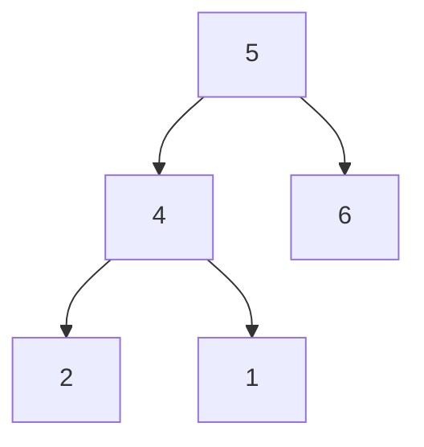
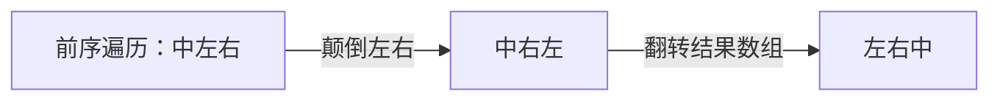

## 链接
[理论基础](https://programmercarl.com/%E4%BA%8C%E5%8F%89%E6%A0%91%E7%90%86%E8%AE%BA%E5%9F%BA%E7%A1%80.html#%E7%AE%97%E6%B3%95%E5%85%AC%E5%BC%80%E8%AF%BE)
[递归遍历](https://programmercarl.com/%E4%BA%8C%E5%8F%89%E6%A0%91%E7%9A%84%E9%80%92%E5%BD%92%E9%81%8D%E5%8E%86.html)
[迭代遍历](https://programmercarl.com/%E4%BA%8C%E5%8F%89%E6%A0%91%E7%9A%84%E8%BF%AD%E4%BB%A3%E9%81%8D%E5%8E%86.html)
[统一迭代](https://programmercarl.com/%E4%BA%8C%E5%8F%89%E6%A0%91%E7%9A%84%E7%BB%9F%E4%B8%80%E8%BF%AD%E4%BB%A3%E6%B3%95.html)

## 知识
### 理论基础

#### 二叉树的种类
解题过程中二叉树有两种主要的形式：满二叉树和完全二叉树（完全二叉树包含满二叉树，满二叉树一定是完全二叉树）

“度”是指一个节点拥有的子节点的数量
##### 满二叉树
满二叉树：如果一棵二叉树只有度为0的结点和度为2的结点，并且度为0的结点在同一层上，则这棵二叉树为满二叉树。也可以说深度为k，有2^k-1个节点的二叉树。
##### 完全二叉树
完全二叉树：除了最底层节点可能没填满外，其余每层节点数都达到最大值，并且**最下面一层的节点都集中在该层最左边的若干位置**。若最底层为第 h 层（h从1开始），则该层包含 1~ 2^(h-1) 个节点。

之前我们刚刚讲过优先级队列其实是一个堆，**堆就是一棵完全二叉树**，同时保证父子节点的顺序关系。
##### 二叉搜索树
前面介绍的树，都是没有数值的，而二叉搜索树是有数值的了，**二叉搜索树是一个有序树**。搜索的时间复杂度是O(logn)。

- 若它的左子树不空，则左子树上所有结点的值均**小于**它的根结点的值；
- 若它的右子树不空，则右子树上所有结点的值均**大于**它的根结点的值；
- 它的左、右子树也分别为二叉排序树
##### 平衡二叉树
平衡二叉树（Balanced Binary Tree）是一种特殊的二叉树，它满足以下性质：对于树中的每一个节点，其左子树和右子树的高度差的绝对值不超过1。这个条件确保了**树的高度大致保持在log(n)级别**，其中n是树中节点的数量。由于这种高度平衡，平衡二叉树可以在对数据进行插入、删除和查找操作时提供较好的性能，特别是保持操作的时间复杂度接近于`O(logn)`。
##### 平衡二叉搜索树
平衡二叉搜索树：又被称为AVL树。具有以下性质：**它是一棵空树或它的左右两个子树的高度差的绝对值不超过1**，并且左右两个子树都是一棵平衡二叉树。

**C++中map、set、multimap，multiset的底层实现都是平衡二叉搜索树**，所以map、set的增删操作时间时间复杂度是logn。map的key和set中的元素是有序的，因为它们的底层实现是平衡二叉搜索树，而平衡二叉搜索树是有序的。

#### 二叉树的存储方式
二叉树可以链式存储，也可以顺序（线性）存储。那么链式存储方式就用指针， 顺序存储的方式就是用数组。顾名思义就是顺序存储的元素在内存是连续分布的，而链式存储则是通过指针把分布在各个地址的节点串联一起。

用数组来存储二叉树如何遍历的呢？如果父节点的数组下标是 i，那么它的左孩子就是 i \* 2 + 1，右孩子就是 i \* 2 + 2。但是用链式表示的二叉树，更有利于我们理解，所以**一般我们都是用链式存储二叉树**。

代码构造二叉树：创造一个头节点，其左指针指向左子节点，右指针指向右子节点，然后向函数中传入头节点即可。

#### 二叉树的遍历方式

二叉树主要有两种遍历方式：

1. 深度优先遍历：先往深走，遇到叶子节点再往回走。
2. 广度优先遍历：一层一层的去遍历。

从深度优先遍历和广度优先遍历进一步拓展，才有如下遍历方式：
1. 深度优先遍历（一般用递归法）
- 前序遍历（递归法，迭代法）
- 中序遍历（递归法，迭代法）
- 后序遍历（递归法，迭代法）
2. 广度优先遍历
层次遍历（迭代法）

这里前中后，**其实指的就是中间节点的遍历顺序**（但是所有遍历顺序都是先左后右）。
左指左子树，右指右子树。在左右子树中继续按照规则搜索。
前序遍历：中左右
中序遍历：左中右
后序遍历：左右中


每个子树和整棵树都遵循中左右/左中右/左右中。

最后再说一说二叉树中深度优先和广度优先遍历实现方式，我们做二叉树相关题目，经常会使用**递归**的方式来实现深度优先遍历，也就是实现前中后序遍历，使用递归是比较方便的。**之前我们讲栈与队列的时候，就说过栈其实就是递归的一种实现结构**，也就说前中后序遍历的逻辑其实都是可以借助**栈**使用递归的方式来实现的。

而广度优先遍历的实现一般使用**队列**来实现，这也是队列先进先出的特点所决定的，因为需要先进先出的结构，才能一层一层的来遍历二叉树。

#### 二叉树的定义

链式存储的二叉树节点的定义方式：
```cpp
struct TreeNode {
    int val;
    TreeNode *left;
    TreeNode *right;
    TreeNode(int x) : val(x), left(NULL), right(NULL) {} // 构造函数
};
```

二叉树的定义和链表是差不多的，相对于链表 ，二叉树的节点里多了一个指针，有两个指针，指向左右孩子。

### 递归遍历

针对leetcode上的三道题目，分别是前序、中序、后序遍历，题号是144，145和94。按照三步来思考，才能保证写出正确的递归代码。所有二叉树的题目都用递归三部曲进行分析。本章节主要讲如何写出递归的代码，不关注底层实现机制。

三部曲：

1. 确定递归函数的参数和返回值
2. 确定终止条件
3. 确定单层递归的逻辑

#### 前序遍历

前序：中左右

1. 确定递归函数的参数和返回值

   没必要一次性确定，可以在写递归函数时根据需要来填充参数。一般参数为根节点和数组，后者用来存放遍历的结果。返回值一般是void，因为我们把想要的结果放在了参数的数组中。

   ```cpp
   void traversal(TreeNode* cur, vector<int>& vec) // 参数为根节点和结果数组
   {
       
   }
   ```

2. 确定终止条件（搞不好会出现栈溢出等问题）。深度优先搜索是遇到NULL时返回。

   ```cpp
   if (cur == NULL)
   	return;
   ```

3. 确定单层递归的逻辑

   ```cpp
   vec.push_back(cur->val); // 中
   treversal(cur->left, vec); // 左
   treversal(cur->right, vec); // 右
   ```

   注意在前序遍历中上面三行代码的顺序不可改变。

#### 中序遍历

左中右。只需要改变第三步：确定单层递归的逻辑的代码。三行代码的顺序不可改变。
```cpp
treversal(cur->left, vec); // 左
vec.push_back(cur->val); // 中
treversal(cur->right, vec); // 右
```

#### 后序遍历

左右中。同样只需要改变第三步：确定单层递归的逻辑的代码。三行代码的顺序不可改变。
```cpp
treversal(cur->left, vec); // 左
treversal(cur->right, vec); // 右
vec.push_back(cur->val); // 中
```

### 迭代遍历

#### 前序遍历
非递归的方式：迭代法，如何实现二叉树的前中后序遍历。通常对简单的递归逻辑，要求写出相应的迭代（非递归）写法。最基础的就是用迭代法实现前中后序遍历。使用迭代法模拟递归，也需要使用到栈这种数据结构。理论上，所有递归都可以用栈模拟出来。

以下面的二叉树为例。



前序遍历上述二叉树，顺序为中左右，输出结果为54216。用栈来辅助遍历上述二叉树。首先将5加入栈中，然后弹出5，将其放入结果数组中。接着处理5的左右孩子，先把6加入栈中，再把4加入栈中（栈是先进后出的），然后弹出4，将其放入结果数组中。接着处理4的左右孩子，依旧是先放右孩子1，再放左孩子2，然后弹出2，加入结果数组中，因为2已经是叶子节点了，接着弹出1，加入结果数组中，最后弹出6，加入结果数组中。结果数组中是54216，符合预期。关键点是先将右孩子放入栈中，再将左孩子放入栈中，这样弹出时就会先弹出左孩子。**弹出时还要关注弹出的节点是否是叶子节点。是，则不需要继续向栈中加入元素；否，则需要向栈中继续加入弹出节点的左右孩子**。

```cpp
vector<int> function(TreeNode* root)
{
    stack<TreeNode*> st; // 栈
    vector<int> res; // 结果数组
    
    st.push(root); // 中节点入栈
    // 栈不为空，则执行以下逻辑
    while (!st.empty())
    {
        // 将中节点从栈中弹出，加入到结果数组中
        TreeNode* node = st.top();
        st.pop();
        if (node != NULL) // 特判：中节点是否为空
            res.push_back(node->val);
        else continue; // 若中节点为空，进入下一次循环
        
        // 将中节点的左右孩子放入栈中，先将右孩子入栈，再将左孩子入栈，这样出栈时才是先左后右的顺序
        st.push(node->right); // 右
        st.push(node->left); // 左
    }
    return res;
}
```

递归模拟前序遍历，本来前序遍历的顺序应该是中左右，但由于栈先进后出的特性，代码中实际的顺序是中右左。

#### 后序遍历

后序遍历是左右中。实现后序遍历的原理如下图所示：



```cpp
vector<int> function(TreeNode* root)
{
    stack<TreeNode*> st;
    vector<int> res;
    
    st.push(root);
    while (!st.empty())
    {
        // 中
        TreeNode* node = st.top();
        st.pop();
        if (node != NULL)
        	res.push_back(node->val);
        else continue;
        
        st.push(root->left); // 左
        st.push(root->right); // 右
    }
    reverse(res.begin(), res.end());
    return res;
}
```

#### 中序遍历

中序遍历无法在前序遍历的基础上通过交换某几行代码的顺序来实现。遍历节点和处理节点是两种逻辑。前序和后序遍历中，遍历的节点和要处理的节点是一个顺序，才能写出上述比较简洁的代码。但在中序遍历中，遍历节点的顺序与和处理节点的顺序不同。后面会继续介绍中序遍历的写法，以及如何像递归写法那样更改几行代码的顺序来实现前中后序遍历的迭代写法。

处理二叉树时有两步操作，一步是访问节点，一步是处理节点。访问节点是从根节点开始，一个节点一个节点地去访问。处理节点是把访问到的节点中的元素放入结果数组中。

以下面的二叉树为例：


对于中序遍历，先访问的节点是5，但先处理的节点应该是1（先把1放入结果数组中）。我们要处理1节点，需要先访问节点5、4、1。这就造成了访问的顺序和处理的顺序不同。因此中序遍历需要另一套写法。

下面模拟中序遍历迭代法的过程。需要一个指针帮助我们遍历二叉树，同时用栈记录遍历过的顺序，然后逆向输出即可。指针一路向左访问，指针先指向5，5入栈；指针再指向4，4入栈；指针再指向1，1入栈。到叶子节点了（叶子节点的左指针为空），便从栈中取出元素，从栈中弹出1并加入到结果数组中。看1的右孩子，为空，故再从栈中弹出4并加入到结果数组中，看4的右孩子，不为空，4的右孩子2入栈。2的左孩子为空，故将2从栈中弹出，加入到结果数组中。再看2的右孩子，为空，故从栈中弹出5并加入到结果数组中。5的右孩子为6，不为空，6入栈。6的左孩子为空，故6出栈，加入结果数组中。6的右孩子为空，本该从栈中弹出元素，但此时栈为空，故结束。结果数组为14256，符合中序遍历的顺序。

**总结**：用指针遍历节点，用栈来记录遍历过的节点，再从栈中弹出元素放入结果数组中。指针一路向左访问，若某个节点的左指针为空，则从栈中取出该节点并放入结果数组中。若某个节点的右指针为空，则从栈中弹出顶部元素并放入结果数组中，若某个节点的右指针不为空，则将右指针指向的节点入栈。

```cpp
vector<int> traversal(TreeNode* root)
{
    vector<int> res;
    stack<TreeNode*> st;
    TreeNode* cur = root; // 用于遍历二叉树的指针，一开始指向根节点
    
    // cur为空且栈也为空时，遍历终止
    while (cur != NULL || !st.empty())
    {
        // 栈用于记录指针访问过的元素
        if (cur != NULL) 
        {
            st.push(cur);
            cur = cur->left; // 指针一路向左访问
        }
        // 指针一路向左，遇到某个节点的左指针为空
        // 则从栈中取出该节点并放入结果数组中
        else 
        {
            cur = st.top();
            st.pop();
            res.push_back(cur->val);
            
            // 看当前指针的右孩子是否为空
            // 若为空，则从栈中弹出顶部节点，并将其加入到结果数组中
            // 若不为空，则将右孩子入栈
            cur = cur->right;
        }
    }
    return res;
}
```

目前迭代法的前中后序遍历没有像递归那样统一起来，其实也是可以统一起来的。统一的写法：用一个栈完成遍历节点和处理节点的过程，但栈中要加入空节点做标记，标记正在遍历的节点和处理的节点。

### 统一迭代

对前中后序这三种遍历方式，使用迭代法是可以写出统一风格的代码。以中序遍历为例，我们就将访问的节点放入栈中，把要处理的节点也放入栈中但是要做标记。如何标记呢，**就是要处理的节点放入栈之后，紧接着放入一个空指针作为标记。** 这种方法也可以叫做标记法。

#### 中序遍历

```cpp
class Solution {
public:
    vector<int> inorderTraversal(TreeNode* root) {
        stack<TreeNode*> st;
        vector<int> res;

        // 根节点非空才将其放入栈中
        if (root != NULL) st.push(root);

        // 循环条件：栈不为空
        while (!st.empty())
        {
            // 弹出栈顶元素
            TreeNode* node = st.top();
            st.pop();

            // node不为空，则按照右中左的顺序访问节点
            if (node != NULL)
            {
                if (node->right) st.push(node->right); // 右节点
                st.push(node); // 中节点
                st.push(NULL); // 中节点访问过，但是还没有处理，加入空节点做为标记
                if (node->left) st.push(node->left); // 左节点
            }
            // 只有遇到空节点的时候，才处理节点（将下一个节点放进结果集）
            else
            {
                // 将空节点弹出，重新取出栈中的元素
                node = st.top();
                st.pop();
                res.push_back(node->val); // 加入到结果集中
            }
        }
        return res;
    }
};
```

对于前序和后序遍历，只需要改变node不为空时访问节点的顺序即可。前序遍历原本的顺序是中左右，考虑到栈先入后出的特性，调整为右左中。后续遍历原本的顺序是左右中，考虑到栈先入后出的特性，调整为中右左。

## 实现

### 递归遍历
#### 144. 前序遍历二叉树
```cpp
class Solution {
public:
    // 前序遍历递归写法的核心函数
    void traversal(TreeNode* root, vector<int> &vec) // 递归函数的参数和返回值
    {
        if (root == NULL) return; // 确定终止条件
        
        vec.push_back(root->val); // 中
        traversal(root->left, vec); // 左
        traversal(root->right, vec); // 右
    }

    // 相当于主函数，调用核心函数
    vector<int> preorderTraversal(TreeNode* root) {
        vector<int> res;

        traversal(root, res); // 调用核心函数
        return res;
    }
};
```
完整的，带有测试样例的代码为：
```cpp
#include <iostream>
#include <vector>
using namespace std;

struct TreeNode {
    int val;
    TreeNode *left;
    TreeNode *right;
    TreeNode() : val(0), left(nullptr), right(nullptr) {}
    TreeNode(int x) : val(x), left(nullptr), right(nullptr) {}
    TreeNode(int x, TreeNode *left, TreeNode *right) : val(x), left(left), right(right) {}
};

class Solution {
public:
    void traversal(TreeNode* root, vector<int>& res) {
        if (root == NULL) return;
        res.push_back(root->val);
        traversal(root->left, res);
        traversal(root->right, res);
    }

    vector<int> preorderTraversal(TreeNode* root) {
        vector<int> res;
        traversal(root, res);
        return res;
    }
};

int main() {
    // 构建树的示例代码，需要根据实际情况调整
    TreeNode* node3 = new TreeNode(3);
    TreeNode* node2 = new TreeNode(2, node3, nullptr);
    TreeNode* root = new TreeNode(1, nullptr, node2);

    Solution solution;
    vector<int> res = solution.preorderTraversal(root);

    // 打印结果
    for (int val : res) {
        cout << val << " ";
    }
    cout << endl;

    // 释放分配的内存（在实际使用中，考虑使用智能指针自动管理内存）
    delete node3;
    delete node2;
    delete root;

    return 0;
}
```

#### 145. 后序遍历二叉树
```cpp
class Solution {
public:
    void traversal(TreeNode* root, vector<int>& res)
    {
        if (root == NULL) return;

        traversal(root->left, res); // 左
        traversal(root->right, res); // 右
        res.push_back(root->val); // 中
    }

    vector<int> postorderTraversal(TreeNode* root) {
        vector<int> res;

        traversal(root, res);
        return res;
    }
};
```
#### 94. 中序遍历二叉树
```cpp
class Solution {
public:
    void traversal(TreeNode* root, vector<int>& res)
    {
        if (root == NULL) return;

        traversal(root->left, res); // 左
        res.push_back(root->val); // 中
        traversal(root->right, res); // 右
    }
    vector<int> inorderTraversal(TreeNode* root) {
        vector<int> res;

        traversal(root, res);
        return res;
    }
};
```

### 迭代遍历
#### 144. 前序遍历二叉树
```cpp
// 顺序为中左右，因为栈的先入后出的特性，所以代码顺序调整为中右左
class Solution {
public:
    vector<int> preorderTraversal(TreeNode* root) {
        stack<TreeNode*> st; // 用栈实现迭代，模拟递归
        vector<int> res; // 结果数组

        st.push(root);

        while (!st.empty())
        {
            TreeNode* node = st.top();
            st.pop();
            if (node != NULL)
                res.push_back(node->val);
            else continue;

            st.push(node->right); // 右
            st.push(node->left); // 左
        }
        return res;
    }
};
```

#### 145. 后序遍历二叉树

```cpp
// 后序遍历：左右中。前序遍历：中左右 
// 中左右->中右左->左右中
class Solution {
public:
    vector<int> postorderTraversal(TreeNode* root) {
        stack<TreeNode*> st;
        vector<int> res;

        st.push(root);

        while (!st.empty())
        {
            TreeNode* node = st.top();
            st.pop();
            if (node != NULL) res.push_back(node->val);
            else continue;

            st.push(node->left); // 左
            st.push(node->right); // 右
        }
        reverse(res.begin(), res.end());
        return res;
    }
};
```
#### 94. 中序遍历二叉树

```cpp
// 中序遍历的迭代写法，参见总结部分的精髓即可写出以下的代码
class Solution {
public:
    vector<int> inorderTraversal(TreeNode* root) {
        stack<TreeNode*> st;
        vector<int> res;
        TreeNode* cur = root;

        // 终止条件：指针和栈都为空
        while (cur != NULL || !st.empty())
        {
            // 指针不为空，则将指针指向的节点放入栈中，指针向左走
            if (cur != NULL)
            {
                st.push(cur);
                cur = cur->left;
            }
            // 指针为空，则将栈顶元素弹出并放入结果数组中，指针向右走
            else
            {
                cur = st.top();
                st.pop();
                res.push_back(cur->val);
                cur = cur->right;
            }
        }
        return res;
    }
};
```

### 统一迭代
#### 94. 中序遍历二叉树
```cpp
class Solution {
public:
    vector<int> inorderTraversal(TreeNode* root) {
        stack<TreeNode*> st;
        vector<int> res;

        // 将非空的头节点插入栈中
        if (root != NULL) st.push(root);

        // 循环终止条件：栈为空
        while (!st.empty())
        {
            // 弹出栈顶元素
            TreeNode* node = st.top();
            st.pop();

            // 若node不为空，则按照右中左的顺序访问节点
            if (node != NULL)
            {
                if (node->right) st.push(node->right); // 访问右节点
                st.push(node); // 访问中节点
                st.push(NULL); // 只访问没处理，在中结点上面添加NULL来标记
                if (node->left) st.push(node->left); // 访问左节点
            }
            // 若node为空，则处理该节点下面的节点，将其加入到res中
            else
            {
                node = st.top();
                st.pop();
                res.push_back(node->val);
            }
        }
        return res;
    }
};
```
#### 144. 前序遍历二叉树
```cpp
class Solution {
public:
    vector<int> preorderTraversal(TreeNode* root) {
        vector<int> res;
        stack<TreeNode*> st;

        if (root != NULL) st.push(root);

        while (!st.empty())
        {
            TreeNode* node = st.top();
            st.pop();

            // node不为空，访问节点
            if (node != NULL)
            {
                if (node->right) st.push(node->right); // 右
                if (node->left) st.push(node->left); // 左
                st.push(node); // 中
                st.push(NULL); // 中节点后面插入NULL
            }
            // node为空，处理节点
            else
            {
                node = st.top();
                st.pop();
                res.push_back(node->val);
            }
        }
        return res;
    }
};
```

#### 145. 后序遍历二叉树

```cpp
// 统一迭代写法
class Solution {
public:
    vector<int> postorderTraversal(TreeNode* root) {
        vector<int> res;
        stack<TreeNode*> st;

        if (root != NULL) st.push(root);

        while (!st.empty())
        {
            TreeNode* node = st.top();
            st.pop();

            // 节点不为空，则访问节点，顺序为中右左
            if (node != NULL)
            {
                st.push(node);
                st.push(NULL);
                if (node->right) st.push(node->right);
                if (node->left) st.push(node->left);
            }
            // 节点为空，则处理节点
            else
            {
                node = st.top();
                st.pop();
                res.push_back(node->val);
            }
        }
        return res;
    }
};
```

## 心得与备忘录
### 递归遍历

1. 记住递归三部曲：
   - 确定递归函数的参数和返回值
   - 确定终止条件
   - 确定单层递归的逻辑
2. 前序、中序、后序遍历的代码只有单层递归的逻辑部分有所不同。更确切地说，只是三行代码的顺序发生了改变。
3. 递归的核心函数返回值为void，结果数组以引用的方式作为参数传入，经过核心函数的改变后，改变后的数组会被传出，在主函数中调用其即可。
4. 易错点：核心函数中忘记加上引用`&`，插入数组时没有取root指针的值(`root->val`)，而是直接将root指针传入了。
5. 注意如何写出完整的带有测试样例的代码，这涉及到如何写`struct TreeNode`和`main`函数。
6. 熟悉几个英文单词：
   - 遍历：traversal
   - 前序：pre-order、中序：in-order、后序：post-order、层序：level-order
   - 二叉树：binary tree
   - 递归：Recursion  迭代：Iteration

### 迭代遍历

1. 迭代遍历的本质是用栈来模拟递归，用结果数组来收集结果。由于栈的先入后出的特性，前序遍历的顺序本来应该是中左右，迭代写法的顺序调整为中右左。后序遍历是在前序遍历的基础上颠倒右和左的顺序，再翻转结果数组（前序遍历=中左右->中右左->左右中=后序遍历）。
2. 中序遍历的迭代写法不能像后序遍历那样从前序遍历迭代写法的基础上直接进行改造。这是因为在中序遍历中，遍历节点的顺序与和处理节点的顺序不同。
3. 中序遍历的迭代写法需要一个指针来遍历所有节点，一个栈用于记录遍历过的节点，一个数组用于存放结果。
4. **中序遍历迭代写法的精髓**：当指针不为空时，用栈记录指针遍历过的元素，指针持续向左走。当指针为空时，从栈中弹出顶部的节点并将其放入结果数组中，然后指针向右走。当指针为空且栈为空时，终止。
5. 统一迭代的写法可以将前中后序遍历的迭代写法统一起来。
6. 迭代写法确实更复杂些，注意事项也更多，也更容易写错。了解思路即可，可以放过。

### 统一迭代

1. 统一迭代的思路其实比较清晰：当头节点非空时，头节点入栈。在栈非空时，不断循环。弹出栈顶节点，若该节点不为空，则按照顺序访问节点，并在访问中节点之后插入NULL，作为标记（说明该节点只被访问过，没有被处理过）；若该节点为空，则处理当前的栈顶节点（原本的栈顶节点已被弹出），将其放入结果数组中，并将其弹出。
2. 对于前序、中序和后序遍历，只需要改变node不为空时访问节点的顺序即可。**考虑到栈先入后出的特性**：前序遍历原本的顺序是中左右，调整为右左中。中序遍历原本的顺序是左中右，调整为右中左。后续遍历原本的顺序是左右中，调整为中右左。
3. 统一迭代思路清晰且对于前中后序遍历能够保持一致的写法，建议用迭代法遍历二叉树时，优先采用统一迭代的写法。前面的迭代遍历的一般写法虽然较为简单，但只能在前序和后序遍历时保持统一，在中序遍历时需要重新写。