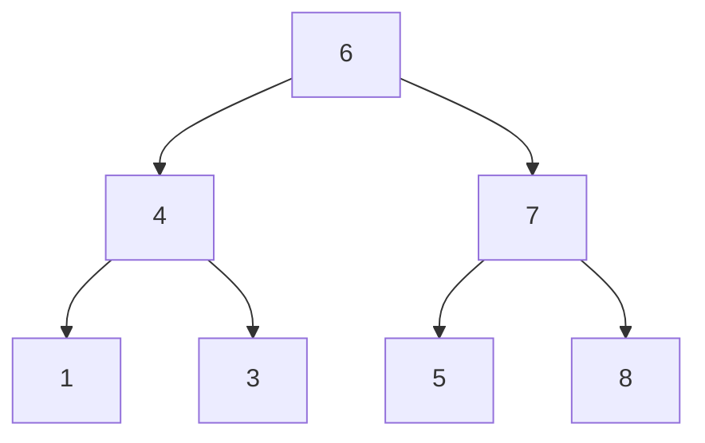

## 链接
[层序遍历](https://programmercarl.com/0102.%E4%BA%8C%E5%8F%89%E6%A0%91%E7%9A%84%E5%B1%82%E5%BA%8F%E9%81%8D%E5%8E%86.html)
[226.翻转二叉树](https://programmercarl.com/0226.%E7%BF%BB%E8%BD%AC%E4%BA%8C%E5%8F%89%E6%A0%91.html)
[101. 对称二叉树](https://programmercarl.com/0101.%E5%AF%B9%E7%A7%B0%E4%BA%8C%E5%8F%89%E6%A0%91.html)

## 知识
### 层序遍历

二叉树的层序遍历相当于图论中的广度优先搜索。leetcode 102：层序输出二叉树。



上述二叉树，一层放在一个数组里，返回的是二维数组。只依赖二叉树本身的结构，无法层序保存二叉树中的节点。需要借助另一种数据结构：队列，用于保存每一层遍历过的元素。图论中的广度优先搜索也是依赖队列实现的。

模拟过程：根节点6加入队列，记录队列大小（size=1）。size表示这层二叉树中有几个元素。接下来弹出当前层的元素6，将6加入到结果数组中，开始处理下一层。再将6的左右孩子4和7加入队列中，此时size=2，第二层的元素个数为2，接下来弹出size（2）个元素，先弹出4，将4的左右孩子1和3加入队列。再弹出7，size归0，第二层遍历结束。弹出7后，再将7的左右孩子5和8加入队列。此时size=4，说明第三层中元素个数为4。接着队列中再弹出size(4)个元素，加入结果数组。上述过程如下图所示。


我尝试根据上述模拟过程独立写出代码，但不知道怎么写while循环结束的条件。直接看卡尔的讲解。
```cpp
vector<vector<int>> res;
queue<TreeNode*> q;
if (root != NULL) q.push(root);

// 遍历的终止条件：队列中无元素
while (q.size())
{
    int size = q.size(); // 记录当前层节点的数量
    vector<int> vec; // 存放一层的节点的值
    // 队列中弹出size个节点，加入到vec中
    while (size -- )
    {
        TreeNode* node = q.front();
        q.pop();
        vec.push_back(node->val);
        
        // 将弹出节点的左右孩子加入到队列中
        if (node->left) q.push(node->left);
        if (node->right) q.push(node->right);
    }
    res.push_back(vec);
}
return res;
```

上述代码也是图论中广度优先搜索的模板。leetcode上有10道题都可以用本模板解决，只需要改动不超过三行代码。

## 初次尝试
### 226.翻转二叉树

我能想到的办法是层序遍历二叉树，然后将每一层的输出数组翻转。但这样做需要将数组还原回到二叉树，比较麻烦。随后有产生想法，让一个节点的左指针指向其右节点，右指针指向其左节点即可，可能需要一个中间变量来存放左节点或者右节点。直接看卡尔的视频。

### 101. 对称二叉树

看到本题，我的第一想法是，本题是翻转二叉树的变式。若一个二叉树被翻转后，仍和原来保持一致，那么就可以认为它是对称二叉树。现在的问题在于如何比较两棵二叉树是否完全相同，我认为可以采用层序遍历，一层层比较即可。或者直接层序遍历完后将二叉树存入一个二维数组中，然后用两重循环+双指针算法判断二维数组是否对称。这样做实际上有个问题：


上面这棵二叉树，层序遍历得到的二维数组为[1, [2, 2], [3, 3]]。二维数组是对称的，但二叉树却不是对称的。还是看卡尔的讲解吧。

## 实现
### 层序遍历

#### 107.二叉树的层次遍历II

只需要在最后翻转res数组即可：`reverse(res.begin(), res.end());`。翻转一个二维数组，二维数组中所有元素（一维数组）的顺序都会颠倒，但一维数组本身（即一维数组内部的顺序不会改变）。reverse函数可以用双指针算法手动实现：
```cpp
int len = res.size();
for (int i = 0, j = len - 1; i < len / 2; i ++ , j -- )
    swap(res[i], res[j]);
```

似乎手动实现的速度要快于调用现成的reverse函数。

#### 199.二叉树的右视图
```cpp
class Solution {
public:
    vector<int> rightSideView(TreeNode* root) {
        vector<int> res;
        queue<TreeNode*> q;

        if (root != NULL) q.push(root);
        while (q.size())
        {
            int size = q.size();
            for (int i = 0; i < size; i ++ )
            {
                TreeNode* node = q.front();
                q.pop();
                if (i == size - 1) res.push_back(node->val); // 将一层最右边的节点的值加入到结果数组中
                if (node->left) q.push(node->left);
                if (node->right) q.push(node->right);
            }
        }
        return res;
    }
};
```

#### 637.二叉树的层平均值

```cpp
class Solution {
public:
    vector<double> averageOfLevels(TreeNode* root) {
        vector<double> res;
        queue<TreeNode*> q;

        if (root != NULL) q.push(root);
        while (q.size())
        {
            int size = q.size();
            double sum = 0;
            for (int i = 0; i < size; i ++ )
            {
                TreeNode* node = q.front();
                q.pop();
                sum += node->val;
                if (node->left) q.push(node->left);
                if (node->right) q.push(node->right);
            }
            res.push_back(sum / size);
        }
        return res;
    }
};
```
#### 429. N叉树的层序遍历
```cpp
/*
// Definition for a Node.
class Node {
public:
    int val;
    vector<Node*> children;

    Node() {}

    Node(int _val) {
        val = _val;
    }

    Node(int _val, vector<Node*> _children) {
        val = _val;
        children = _children;
    }
};
*/

class Solution {
public:
    vector<vector<int>> levelOrder(Node* root) {
        vector<vector<int>> res;
        queue<Node*> q;

        if (root != NULL) q.push(root);
        while (q.size())
        {
            vector<int> vec;
            int size = q.size();

            while (size -- )
            {
                Node* node = q.front();
                q.pop();
                vec.push_back(node->val);
                for (int i = 0; i < node->children.size(); i ++ )
                    if (node->children[i]) q.push(node->children[i]);
            }
            res.push_back(vec);
        }
        return res;
    }
};
```

#### 515.在每个树行中找最大值

```cpp
class Solution {
public:
    vector<int> largestValues(TreeNode* root) {
        vector<int> res;
        queue<TreeNode*> q;

        if (root != NULL) q.push(root);
        while(q.size())
        {
            int size = q.size();
            int max = -2147483648; // Node.val的最小值，可简写为int max = INT_MIN;
            while (size -- )
            {
                TreeNode* node = q.front();
                q.pop();
                max = node->val > max ? node->val: max; // 注意问号表达式的用法
                if (node->left) q.push(node->left);
                if (node->right) q.push(node->right);
            }
            res.push_back(max);
        }
        return res;
    }
};
```

#### 116. 填充每个节点的下一个右侧节点指针

```cpp
class Solution {
public:
    Node* connect(Node* root) {
        queue<Node*> q;

        if (root != NULL) q.push(root);
        while (q.size())
        {
            int size = q.size();
            Node* node0, *node; 
            for (int i = 0; i < size; i ++ )
            {
                // 取出一层的头结点
                if (i == 0)
                {
                    node0 = q.front();
                    q.pop();
                 // 本句话的目的：当一层只有头节点时，可以让该头节点在弹出的同时继续在队列中行插入其左右子节点
                    node = node0; 
                }
                // 本层前一个节点next指向本节点
                else
                {
                    // node0和node交替前进
                    node = q.front();
                    q.pop();
                    node0->next = node;
                    node0 = node;
                }
                if (node->left) q.push(node->left);
                if (node->right) q.push(node->right);
            }
            // 本层最后一个节点指向NULL
            node->next = NULL;
        }
        return root;
    }
};
```

#### 117.填充每个节点的下一个右侧节点指针II

本题代码和116完全相同。116题目中的条件：完整二叉树实际上是多余的。不管是不是完整二叉树，都可以用同样的代码解题。

#### 104.二叉树的最大深度

```cpp
class Solution {
public:
    int maxDepth(TreeNode* root) {
        int res = 0;
        queue<TreeNode*> q;

        if (root != NULL) q.push(root);
        while (q.size())
        {
            int size = q.size();
            while (size -- )
            {
                TreeNode* node = q.front();
                q.pop();
                if (node->left) q.push(node->left);
                if (node->right) q.push(node->right);
            }
            res ++ ;
        }
        return res;
    }
};
```

#### 111.二叉树的最小深度

```cpp
class Solution {
public:
    int minDepth(TreeNode* root) {
        int res = 0;
        queue<TreeNode*> q;

        if (root != NULL) q.push(root);
        while (q.size())
        {
            int size = q.size();
            bool flag = true;
            while (size -- )
            {
                TreeNode* node = q.front();
                q.pop();
                if (node->left == NULL && node->right == NULL)
                {
                    flag = false;
                    break;
                }
                if (node->left) q.push(node->left);
                if (node->right) q.push(node->right);
            }
            res ++ ;
            if (flag == false) break;
        }
        return res;
    }
};
```

注意：只有当某个节点的左右孩子都为空，这个节点才在二叉树的底部。一旦遇到这样的节点，立即跳出循环，返回res。根据这个思路，我将上述代码做了简化：
```cpp
class Solution {
public:
    int minDepth(TreeNode* root) {
        int res = 0;
        queue<TreeNode*> q;

        if (root != NULL) q.push(root);
        while (q.size())
        {
            int size = q.size();
            while (size -- )
            {
                TreeNode* node = q.front();
                q.pop();
                if (node->left == NULL && node->right == NULL)
                    return ++ res;
                if (node->left) q.push(node->left);
                if (node->right) q.push(node->right);
            }
            res ++ ;
        }
        return res;
    }
};
```

### 226.翻转二叉树

面试中的常考题。本质是交换每个节点的左右孩子，交换的是指针而非数值。这道题显然用递归解比较简单，但要想清楚用哪种遍历顺序。**本题用前序和后序是最直接的，用中序遍历代码比较难写**。迭代和层序遍历也可以做此题，但不要求掌握。

递归三部曲：

- 确定递归函数的返回值和参数: `TreeNode* invertTree(root)`

- 确定函数的终止条件：`if (root == NULL) return root`

- 具体的处理逻辑：前序遍历——中左右

   对中节点，需要交换中节点的左右孩子: `swap(root->left, root->right)`

   左节点：`invertTree(root->left);`

   右节点：`invertTree(root->right);`

   将swap函数放在处理逻辑的最后，就是左右中，就是后续遍历。因此前序和后续遍历皆可解本题。但中序遍历不可以，举个例子：
   ```mermaid
  graph TD;
      A[4] --> B[2];
      A --> C[7];
      B --> D[1];
      B --> E[3];
      C --> F[6]
      C --> G[9]
  ```

   ```mermaid
  graph TD;
      A[4] --> B[2];
      A --> C[7];
      B --> D[3];
      B --> E[1];
      C --> F[6]
      C --> G[9]
   ```

   ```mermaid
  graph TD;
      A[4] --> B[7];
      A --> C[2];
      B --> D[6];
      B --> E[9];
      C --> F[3]
      C --> G[1]
   ```

   ```mermaid
  graph TD;
      A[4] --> B[7];
      A --> C[2];
      B --> D[6];
      B --> E[9];
      C --> F[1]
      C --> G[3]
   ```

   相当于原先根节点的左子树被处理了两次，原先根节点的右子树没被处理。对中序遍历的写法，具体的逻辑应该为：

   ```cpp
  invertTree(root->left); // 处理左子树
  swap(root->left, root->right); // 交换左右子树，原先的右子树变为了现在的左子树，原先的左子树变为了现在的右子树
  invertTree(root->left); // 原先的左子树已经被处理过了，现在需要处理原先的右子树，就是现在的左子树
   ```

   不建议绕弯子去写中序，很容易出错。

前序遍历：
```cpp
// 前序遍历写法
class Solution {
public:
    TreeNode* invertTree(TreeNode* root) {
        if (root == NULL) return root; // 终止条件

        // 中左右
        swap(root->left, root->right);
        invertTree(root->left);
        invertTree(root->right);
        return root; // 每次递归后返回结果
    }
};
```

后序遍历写法：
```cpp
// 后序遍历写法
class Solution {
public:
    TreeNode* invertTree(TreeNode* root) {
        if (root == NULL) return root;

        // 左右中
        invertTree(root->left);
        invertTree(root->right);
        swap(root->left, root->right);
        return root;
    }
};
```

中序遍历写法(**绕，理解即可，不要写**)：
```cpp
// 中序遍历写法
class Solution {
public:
    TreeNode* invertTree(TreeNode* root) {
        if (root == NULL) return root;

        // 左中右
        invertTree(root->left);
        swap(root->left, root->right);
        invertTree(root->left);
        return root;
    }
};
```

### 101. 对称二叉树

本质上是判断根节点的左子树和右子树是否可以互相翻转。需要比较二叉树同是外侧的节点和同是内侧的节点是否相等。接着考虑用哪种方式遍历二叉树。**二叉树类的题目确定遍历顺序非常重要**。**本题目只能使用后序遍历**（左右中）。因为我们需要先收集完根节点左右孩子的信息再返回给根节点，才能知道根节点的左右孩子是否相同，进而知道二叉树是否是对称的。

1. 确定函数传入的参数和返回值

   ```cpp
   // 判断根节点的左右子树是否可以互相翻转
   // 本质是判断两个二叉树是否可以相互翻转，因此需要同时处理两棵二叉树
   bool compare(TreeNode* left, TreeNode* right) // 传入的参数为左子树的头节点和右子树的头节点
   {
   }
   ```
2. 确定终止条件
   共有以下5种情况
   |左节点|右节点|返回值|
   |:---:|:---:|:---:|
   |空|非空|false|
   |非空|空|false|
   |空|空|true|
   |非空且值不等|非空且值不等|false|
   |非空且值相等|非空且值相等|继续向下遍历，写单层递归的逻辑|

   ```cpp
   if (left == NULL && right != NULL) return false;
   else if (left != NULL && right == NULL) return false;
   else if (left == NULL && right == NULL) return true;
   else if (left->val != right->val) return false;
   ```

3. 单层递归的逻辑（如何像下一层遍历）
   同是外侧的节点和同是内侧的节点相同，才可以return true。
   
   ```cpp
   bool outside = compare(left->left, right->right); // 比较一对外侧节点是否相同
   bool inside = compare(left->right, right->left);  // 比较一对内侧节点是否相同
   bool res = outside && inside; // 内外侧节点都相同，则才可以左右翻转
   return res; 
   ```
   
   上面代码框的前三行代码分别对应后序遍历的左右中。中只能放在最后，不能提前，否则会出现还没计算outside和inside就来计算res的情况，因此必须是后序遍历。
   

后序遍历解决本题的完整代码：
```cpp
class Solution {
public:
    bool compare(TreeNode* left, TreeNode* right)
    {
        if (left == NULL && right == NULL) return true;
        else if (left == NULL && right != NULL) return false;
        else if (left != NULL && right == NULL) return false;
        else if (left->val != right->val) return false;

        bool outside = compare(left->left, right->right);
        bool inside = compare(left->right, right->left);
        bool res = outside && inside;
        return res;
    }

    bool isSymmetric(TreeNode* root) {
        return compare(root->left, root->right);
    }
};
```
本题也可以用迭代法实现。

#### 572.另一个树的子树

```cpp
class Solution {
public:
    bool compare(TreeNode* left, TreeNode* right)
    {
        if (left == NULL && right == NULL) return true;
        else if (left != NULL && right == NULL) return false;
        else if (left == NULL && right != NULL) return false;
        else if (left->val != right->val) return false;

        bool outside = compare(left->left, right->left);
        bool inside = compare(left->right, right->right);
        bool res = outside && inside;
        return res;
    }
    bool isSubtree(TreeNode* root, TreeNode* subRoot) {
        if (subRoot == NULL) return true;
        else if (root == NULL) return false;
        else if (compare(root, subRoot)) return true;
        // 递归比较root树的子树和subRoot是否相同
        return isSubtree(root->left, subRoot) || isSubtree(root->right, subRoot);
    }
};
```

本题注意如何递归地比较root树的子树和subRoot树是否相同：`return isSubtree(root->left, subRoot) || isSubtree(root->right, subRoot);`。

## 心得与备忘录

### 层序遍历

1. 本题（leetcode102）的模板需要熟记，可以用来解决10道leetcode。
2. 本题的关键在于用队列来保存每一层遍历过的元素。
3. **本题的思路可以概括为**：将二叉树的一层加入到队列中，记录队列的大小为size。然后弹出size个节点，用数组收集弹出的节点，并在弹出节点的同时插入弹出的节点的左右子节点。弹完size个节点后，数组中就是当前层的所有元素，而队列中则是下一层的所有节点。
4. 本题不需要用指针来遍历整棵树，只需要对维护和操作队列即可。
5. 本题收获最终结果的退出条件为队列为空；二叉树的一层遍历完毕的退出条件为size = 0。
6. 二叉树的右视图这题需要特别注意，以下写法是错误的：
   ```cpp
   class Solution {
   public:
       vector<int> rightSideView(TreeNode* root) {
           vector<int> res;
           queue<TreeNode*> q;
   
           if (root != NULL) q.push(root);
           while (q.size())
           {
               int size = q.size();
               while (size -- )
               {
                   TreeNode* node = q.front();
                   q.pop();
                   res.push_back(node->val);
                   if (node->right) q.push(node->right);
               }
           }
           return res;
       }
   };
   ```

   原因是：对于以下的二叉树：
   ```mermaid
   graph TD;
       A[6] --> B[4];
       A --> C[NULL];
   ```

   尽管6只有左子节点，没有右子节点，但站在二叉树的右边看这颗二叉树，看到的结果是[6, 4]，如果按照上面的写法，则返回的结果是[6]，4作为左子节点不会被加入到队列中，也不会出现在结果数组中。

7. N叉树的层序遍历需要注意：新定义的N叉树的名字叫Node，不要下意识地写成TreeNode。在队列中更新N叉树下一层的节点时，注意需要用for循环遍历一遍当前node的孩子数组，因为N叉树中的一个节点不仅有左右孩子，而是有一个孩子数组。

8. 二叉树的最大深度的解题关键在于：层序遍历二叉树，每遍历完一层记录层数的变量+1。

9. 二叉树的最大/最小深度这两道题，`res ++ `放在第二重while循环之后和之前都可以。我在实现中的写法都是把`res ++ `放在了第二重while循环之后，但实际上放在第二重while循环之前写出的代码更简洁易懂，可以参考代码随想录上给出的代码。

10. 注意复习填充每个节点的下一个右侧节点指针，这道题第一遍没有写出来。本题的关键在于特判一层的头节点，以及node0和node交替前进。

11. 116和117题的代码完全相同。差别只在于116题题目说是完整二叉树，117题目则没有这个说明。

### 226.翻转二叉树

1. 注意：本题中的root是指遍历的每个节点，而非特指根节点。

2. 本题的关键思路：交换中节点的左右子树，递归处理左右节点。

3. 记住前序和后续的写法即可，swap要么写在左右的上面，要么写在左右的下面。抛弃中序写法，太绕！

4. 记得最后要`return root`。因为终止条件：`if (root == NULL) return root`，只会返回一个为空的节点。大多数情况下不会触发这个终止条件，而是触发最后一个`return root`。

5. 可以定义一个cur节点遍历二叉树的每个节点，这样就不会与根节点root产生混淆。

   ```cpp
   // 前序遍历写法
   class Solution {
   public:
       TreeNode* invertTree(TreeNode* root) {
           TreeNode* cur = root;
           if (cur == NULL) return cur;
   
           // 中左右
           swap(cur->left, cur->right);
           invertTree(cur->left);
           invertTree(cur->right);
           return cur;
       }
   };
   ```

6. 本题除递归写法外，用一般迭代、统一迭代、层序遍历的写法都可以，其实在原本的三种迭代方式的代码的基础上稍作修改就可以，但三种迭代方式的代码本身就已经较为复杂，容易写错，因此除非必须建议不要采用迭代写法。

7. 但还是不得不说，**层序遍历解本题也很方便**，本题也可以归类到层序遍历能够解决的10道题中，在层序遍历的基础上，交换每个节点的左右子节点即可，代码如下所示：
   ```cpp
   class Solution {
   public:
       TreeNode* invertTree(TreeNode* root) {
           queue<TreeNode*> q;
   
           if (root != NULL) q.push(root);
           while (q.size())
           {
               int size = q.size();
               while (size -- )
               {
                   TreeNode* node = q.front();
                   q.pop();
                   swap(node->left, node->right); // 交换每个节点的左右子节点
                   if (node->left) q.push(node->left);
                   if (node->right) q.push(node->right);
               }
           }
           return root;
       }
   };
   ```


### 101. 对称二叉树

1. 本题实际上需要比较根节点的左右子树是否可以相互翻转，因此需要同时遍历两棵树，所以传入的参数为左右子树的头节点。
2. 本题只能采用后序遍历，遍历左子树的顺序是左右中，遍历右子树的顺序是右左中。
3. 终止条件需要分五类讨论。见实现中的表格。
4. 单层递归的核心逻辑为：判断同在外侧的节点是否相同，判断同在内侧的节点是否相同。
5. 本题的迭代写法其实也不难理解，原理是通过一个容器来成对的存放我们要比较的元素。但优先掌握本题的递归写法即可。
6. 100.相同的树和572.另一个树的子树基本和本题是一样的，只要稍加修改就可以。572题稍有特殊，需要注意如何递归地比较root树的子树和subRoot树是否相同。同时在主函数中也需要进行分类讨论（subRoot树为空, root树为空，两树相同，root树的子树和subRoot树相同/相异）。
