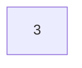
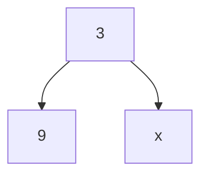
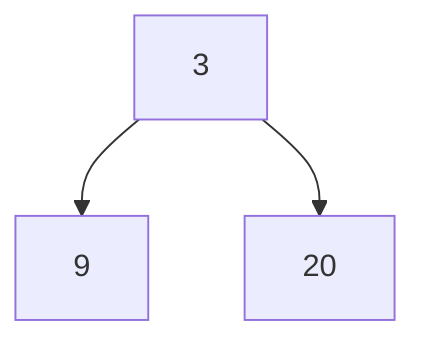
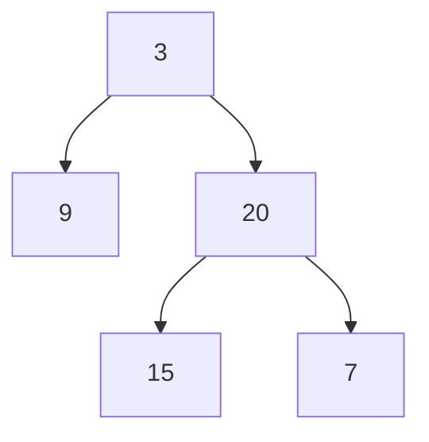
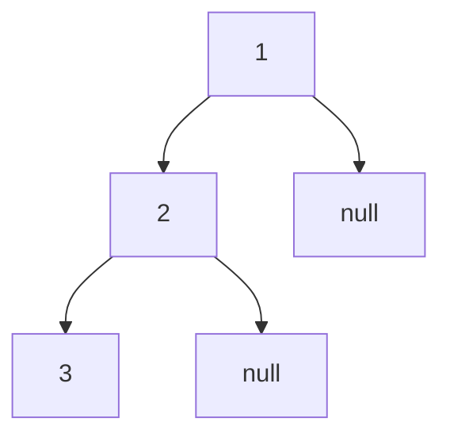
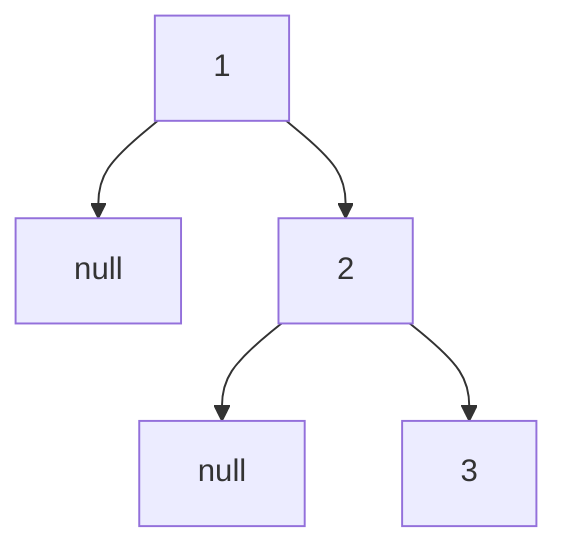

## 链接

[513.找树左下角的值](https://programmercarl.com/0513.%E6%89%BE%E6%A0%91%E5%B7%A6%E4%B8%8B%E8%A7%92%E7%9A%84%E5%80%BC.html)
[112. 路径总和，113. 路径总和ii](https://programmercarl.com/0112.%E8%B7%AF%E5%BE%84%E6%80%BB%E5%92%8C.html)
[106.从中序与后序遍历序列构造二叉树，105.从前序与中序遍历序列构造二叉树](https://programmercarl.com/0106.%E4%BB%8E%E4%B8%AD%E5%BA%8F%E4%B8%8E%E5%90%8E%E5%BA%8F%E9%81%8D%E5%8E%86%E5%BA%8F%E5%88%97%E6%9E%84%E9%80%A0%E4%BA%8C%E5%8F%89%E6%A0%91.html)

## 知识

### 106.从中序与后序遍历序列构造二叉树

`vector<int> lm(inorder.begin(), inorder.begin() + i);`创建了一个左闭右开的区间。在C++中，`std::vector`的这个构造函数接受两个迭代器作为参数，分别表示要复制的范围的开始和结束。这个范围遵循左闭右开的原则，即包括开始位置的元素，但不包括结束位置的元素。

## 初次尝试

### 513.找树左下角的值

拿到本题后，我先复习了层序遍历的代码，然后先拿层序遍历法尝试一下。本题果然可以简单地用层序遍历解决：

```cpp
class Solution {
public:
    int findBottomLeftValue(TreeNode* root) {
        queue<TreeNode*> q;
        vector<vector<int>> res;

        if (root != NULL) q.push(root);
        while (q.size())
        {
            int size = q.size();
            vector<int> vec;

            while (size -- )
            {
                TreeNode* node = q.front();
                q.pop();
                vec.push_back(node->val);
                if (node->left) q.push(node->left);
                if (node->right) q.push(node->right);
            }
            res.push_back(vec);
        }
        // 下面两行代码可以简写为return res.back().front();
        vector<int> ans = res.back();
        return ans.front();
    }
};
```

现在尝试用递归做本题。首先需要考虑前/中/后序遍历。发现确实不好写，不知道该采用怎样的遍历顺序，且终止条件也不知道该怎么写，直接看卡尔的讲解。

### 112. 路径总和

本题用层序遍历肯定不好做，因为涉及到从root节点到叶子节点。我尝试用递归解决本题。本题肯定涉及到回溯，搜索完一条root节点到叶子节点的和之后，若没找到targetSum，还需要返回root节点，寻找到新的叶子节点的路径。我不会做此题，直接看卡尔的讲解。

### 113. 路径总和ii

本题我尝试用112的方法独立完成，但是没有成功，其实我写的代码离能成功运行的代码已经很接近了，思路没错就是部分细节不对。本题的方法应该和112相同，但代码实现上会复杂一些。

### 106.从中序与后序遍历序列构造二叉树

本题是二叉树中的难题，我没有什么思路，直接来看卡尔的视频。

### 105.从前序与中序遍历序列构造二叉树

本题的核心思路和106完全一致，我独立写出了本题的代码。

## 实现

### 513.找树左下角的值

树左下角的值：树的最后一行最靠左侧的值（不一定是左孩子）。本题用层序遍历（迭代法）最合适，目标值就是最后一层的第一个值。**本题用迭代法比用递归法更简单直观**。现在主要讲解递归法。

如何用递归法找到树左下角的值？深度最大的叶子节点一定在最后一行。因为本题不需要处理中节点，只需要先遍历左节点即可，**因此本题使用前中后序遍历都可**。**只要保证先遍历左节点，且得到的是深度最大的节点**，找到的就是最后一行最靠左侧的节点。现在开始写代码：

```c++
// 记录二叉树最大深度的全局变量
int maxDepth = INT_MIN; // 初始化为int中的最小值
int res; // 若当前深度大于maxDepth，则更新res为当前节点的值

// depth用于记录当前遍历的节点的深度
void traversal(TreeNode* root, int depth)
{
    // 终止条件：遍历到叶子节点
    if (root->left == NULL && root->right == NULL) 
    {
        // 若当前深度大于maxDepth，则更新res为当前节点的值
        if (depth > maxDepth) 
        {
            maxDepth = depth;
            res = root->val;
        }
    }
  
    // 单层递归的逻辑，前中后序遍历皆可，本题不需要中节点的处理逻辑
    // 左节点
    if (root->left)
    {
        depth ++ ;
        traversal(root->left, depth); // 递归
        depth -- ; // 回溯，即回退到左节点的父节点，然后遍历父节点的右节点，不回溯则会一直向左遍历
        // 以上三行代码可以简写为traversal(root->left, depth + 1)
        // 因为depth + 1并没有改变depth的值，相当于在traversal中+1，在traversal之后复原
    }
  
    // 右节点
    if (root->right)
    {
        depth ++ ;
        traversal(root->right, depth);
        depth -- ;
    }
}
```

本题的递归解法同样显示地展现了回溯。根据上述核心代码，我写出了本题递归解法的完整代码：

```cpp
class Solution {
public:
    int maxDepth = INT_MIN; // 直接int maxDepth = 0也可以
    int res;

    void traversal(TreeNode* root, int depth)
    {
        // 终止条件，遍历到叶子节点
        // 若当前深度大于最大深度，则需要更新最大深度和结果
        if (root->left == NULL && root->right == NULL)
        {
            if (depth > maxDepth)
            {
                res = root->val;
                maxDepth = depth;
            }
        }

        // 单层递归的逻辑
        // 左节点
        if (root->left)
        {
            depth ++ ;
            traversal(root->left, depth);
            depth -- ;
        }

        // 右节点
        if (root->right)
        {
            depth ++ ;
            traversal(root->right, depth);
            depth -- ;
        }
    }

    int findBottomLeftValue(TreeNode* root) {
        traversal(root, 1); // root节点的深度一般被规定为1，当然规定为0也可以
        return res;
    }
};
```

本题的层序遍历解法其实也有更简便的写法，不需要浪费空间复杂度来存储树中的所有元素的值。代码如下所示：

```cpp
class Solution {
public:
    int findBottomLeftValue(TreeNode* root) {
        queue<TreeNode*> q;

        if (root != NULL) q.push(root);

        int res;
        while (q.size())
        {
            int size = q.size();

            for (int i = 0; i < size; i ++ )
            {
                TreeNode* node = q.front();
                q.pop();
                if (i == 0) res = node->val;
                if (node->left) q.push(node->left);
                if (node->right) q.push(node->right);
            }
        }
        return res;
    }
};
```

### 112. 路径总和

题意：有无从root节点到叶子节点的一条路径，路径上所有元素之和等于目标和。推荐使用递归法。本题使用前中后序遍历皆可，因为不涉及中节点的处理逻辑，因此中节点放在哪里都可以。规则看似简单，但代码不好写。现在开始写代码：

```cpp
// 返回值为bool类型，找到一条符合条件的路径，立即从下（叶子节点）往上（根节点）返回true
// cnt：计数器，在主函数中传入目标值
// 如果传入0，从上往下遍历每遍历到一个节点就加上这个节点的值，看遍历到叶子节点时cnt是否等于target，这样代码更复杂，不如直接传入target，每次遍历到一个节点就在target中减去该节点的值，看到叶子节点时cnt是否为0
bool traversal(TreeNode* node, int cnt) 
{
    // 终止条件：遇到叶子节点且cnt=0
    if (node->left == NULL && node->right == NULL && cnt == 0) return true;
    if (node->left == NULL && node->right == NULL && cnt != 0) return false;
  
    // 单层递归逻辑
    // 左节点
    if (node->left)
    {
        cnt -= node->left->val; // 从cnt中减去左节点的值
        // 若返回true，则说明node的左孩子到叶子节点的路径中有符合题目要求的路径
        // 此时目标值为cnt -= node->left->val
        // 此时应该继续向上返回true，这样才能一层层将true的结果返回给根节点
        if (traversal(node->left, cnt)) return true;
        // 回溯，遍历到叶子节点后，需要回退到根节点去遍历一条新的路径，因此需要回溯
        // 若不回溯，则cnt一直做减法，则遍历完左子树后，遍历右子树时根本不可能找到符合条件的路径
        cnt += node->left->val;
    }
  
    // 右节点，逻辑同上
    if (node->right)
    {
        cnt -= node->right->val;
        if (traversal(node->right, cnt)) return true;
        cnt += node->right->val;
    }
    // 一直不return true, 则return false
    return false;
}
```

以上代码没有对中节点的处理逻辑，因此前中后序都可以。对左右节点的处理逻辑可以简写为一句话，我以左节点为例：`if (traversal(node->left, cnt -= node->left->val)) return true;`，但不建议这样写，因为无法清晰地看到回溯的逻辑。

本题的完整代码如下所示：

```cpp
class Solution {
public:
    bool traversal(TreeNode* node, int cnt)
    {
        // 终止条件：遍历到叶子节点
        if (node->left == NULL && node->right == NULL && cnt == 0)
            return true;
        // if (node->left == NULL && node->right == NULL && cnt != 0)
        //     return false;
      
        // 左节点
        if (node->left)
        {
            cnt -= node->left->val;
            if (traversal(node->left, cnt)) return true;
            cnt += node->left->val;
        }

        // 右节点
        if (node->right)
        {
            cnt -= node->right->val;
            if (traversal(node->right, cnt)) return true;
            cnt += node->right->val;
        }
        return false;
    }
    bool hasPathSum(TreeNode* root, int targetSum) {
        if (root == NULL) return false;
        return traversal(root, targetSum - root->val);
    }
};
```

### 113. 路径总和ii

本题由于要遍历整棵树，找到所有路径，因此递归函数不要返回值，遍历完整棵树后，在函数外定义好的 `path`和 `res`中自然会被递归函数写入应有的结果。如果只是要找树中符合条件的一条路径，那么递归函数就要返回值，一旦遍历到叶子节点时找到了合适的路径，就立即返回true，要是一直找不到符合条件的路径，再返回false。

本题的代码相较于上一题要复杂一些，但**核心思路其实是相同的**。以下几点是与112的主要差异。

- 首先定义一个 `vector<int> path`来存放一条符合条件的路径，再定义一个 `vector<vector<int>> res`来存放树中所有符合条件的路径。
- 在针对左右节点的操作中，需要回溯，但与112不同的是，本题中的回溯不仅需要回溯 `cnt`，还需要回溯 `path`中的元素（先将左右节点放入path中，回溯时又从path中弹出左右节点）。
- 由于本题的递归函数没有返回值，因此只需要返回空即可，即 `return;`。
- 本题需要在主函数中在path中事先插入根节点的值，作为启动的引线（可以想想极端情况，树中只有一个节点，即根节点，如果不在path中事先插入根节点的值，那么即使根节点的值等于 `targetSum`，res中也不会存有根节点的值）。

本题的具体代码如下所示：

```cpp
class Solution {
public:
    vector<int> path;
    vector<vector<int>> res;
  
    // 本题的递归函数不需要返回值
    void traversal(TreeNode* node, int cnt)
    {
        if (node->right == NULL && node->left == NULL && cnt == 0) 
        {
            res.push_back(path);
            return;
        }

        if (node->right == NULL && node->left == NULL) return;

        // 左节点
        if (node->left)
        {
            path.push_back(node->left->val);
            cnt -= node->left->val;
            traversal(node->left, cnt); // 递归
            path.pop_back(); // 回溯
            cnt += node->left->val; // 回溯
        }

        // 右节点
        if (node->right)
        {
            path.push_back(node->right->val);
            cnt -= node->right->val;
            traversal(node->right, cnt); // 递归
            path.pop_back(); // 回溯
            cnt += node->right->val; // 回溯
        }
        return;
    }
    vector<vector<int>> pathSum(TreeNode* root, int targetSum) {
        if (root == NULL) return res;
        path.push_back(root->val); // 事先把根节点放进路径

        traversal(root, targetSum - root->val);
        return res;
    }
};
```

### 106.从中序与后序遍历序列构造二叉树

任务：从中序和后序数组中构造出一棵唯一的二叉树。思路：如何用两个数组构造二叉树？
中序：左中右，例：9 3 15 20 7
后序：左右中，例：9 15 7 20 3
由于需要确定根节点，根节点是中节点，而根据中序数组无法确定出根节点的位置，这时就需要后序数组。后序数组的最后一个元素一定是中节点，也就是根节点。以上述两数组为例，根节点就是3。



再看中序数组，root是3，则左节点是9，右节点是15，20，7。这一步操作就是利用后序数组中找到的root节点在中序数组中完成切割的任务。



再利用中序数组中切割出的两部分在后序数组中完成切割。由上一步知，左节点是9，右节点是15，20，7。结合后序数组知，右节点是15，7，20。右节点中最后一个元素是20，因此20是右子树的中节点。



再利用后序数组去切割中序数组。20是右子树的中节点，中序数组中的右区间为15，20，7，因此左节点是15，右节点是7。



关键：先通过后序数组找到root节点，再利用root节点切割中序数组，再利用中序数组切割出的左右区间切割后序数组，交替进行。可以具体为以下六步：

1. 后序数组为空，说明无root节点，返回空的树
2. 后序数组最后一个元素作为root
3. 寻找中序数组中root的位置作为切割点
4. 切割中序数组，切为左右区间
5. 根据切割中序数组得到的左右区间切割后序数组
6. 递归处理，构造下一层子树

现在开始写本题的伪代码（注重整体思路而非细节）：

```cpp
// 确定递归函数的参数和返回值
// 返回值：二叉树的根节点
TreeNode* traversal(vector<int> inorder, vector<int> postorder)
{
    // 终止条件：后序数组为空
    if (postorder.size() == 0) return NULL;
  
    // 后序数组的最后一个元素为root节点的值
    int rootvalue = postorder[postorder.size() - 1];
    TreeNode* root = new TreeNode(rootvalue);
  
    // 优化：若postorder中只有一个元素，则该元素必为叶子节点（root节点也是叶子节点）
    if (postorder.size() == 1) return root;
  
    // 单层递归的逻辑
    // 寻找中序数组中root的位置作为切割点
    int i;
    // 返回中序数组中root的index
    for (i = 0; i < inorder.size(); i ++ )
    {
        if (inorder[i] == rootvalue)
            break; 
    }
  
    // 根据root切中序数组，得到一个左中序数组和一个右中序数组
    // 切后序数组，拿上一步得到的左中序数组来切出后序数组的左区间和右区间，得到一个左后序数组和一个右后序数组
    // 递归处理左区间和右区间，即递归构建root的左右子树
    root->left = traversal(左中序, 左后序);
    root->right = traversal(右中序, 右后序);
    return root;
}
```

注意：

- 切中序数组和切后序数组时需要有统一的区间定义。要么都坚持左闭右开，要么都坚持左闭右闭。
- 先切中序数组，再切后序数组。因为中序数组中的左区间和后序数组中的左区间一定相同。
- 建议debug时打印切中序数组得到的左中序和右中序数组，打印切后序数组的左后序和右后序数组。

中序和前序数组也可以唯一地确定一棵二叉树。前序数组是中左右，拿着前序数组的第一个元素，即为root元素，拿去切中序数组。剩下的思路是相同的。

中序和后序数组可以唯一地确定二叉树，中序和前序数组也可以唯一地确定二叉树，**但后序和前序数组不能唯一地确定二叉树**。原因：前序数组和后序数组都可以直接知道root在哪里，但前序和后序数组的左右区间的分割点我们找不到。中序数组的重要性在于其把左右区间给分隔开了。举例：



对以上二叉树，前序数组：123，后序数组：321



对以上二叉树，前序数组：123，后序数组：321
虽然两棵二叉树的前序数组和后序数组完全一致，但这两棵二叉树完全不同，**因此仅靠前序和后序数组不能唯一地确定二叉树**。

本题是二叉树中的难题、复杂题，需要经常复习。以上笔记cover了易错点。

根据上述原理，我写出了以下代码：

```cpp
class Solution {
public:
    TreeNode* traversal(vector<int>& inorder, vector<int>& postorder)
    {
        if (postorder.size() == 0) return NULL;

        int rootvalue = postorder[postorder.size() - 1];
        TreeNode* root = new TreeNode(rootvalue);
        if (postorder.size() == 1) return root;

        // 找到inorder中root的下标
        int i;
        for (i = 0; i < inorder.size(); i ++ )
        {
            if (inorder[i] == rootvalue)
                break;
        }

        // 将inorder根据i分为左中数组和右中数组
        vector<int> lm;
        vector<int> rm;
        for (int j = 0; j < i; j ++ ) 
        {
            lm.push_back(inorder[j]); 
            cout << inorder[j] << ' '; // 打印lm数组中的所有元素
        }
        cout << endl;
        for (int j = i + 1; j < inorder.size(); j ++ ) 
        {
            rm.push_back(inorder[j]); 
            cout << inorder[j] << ' '; // 打印rm数组中的所有元素
        }
        cout << endl;

        postorder.resize(postorder.size() - 1);

        // 将postorder根据上一步的结果分为左后数组和右后数组
        vector<int> lb;
        vector<int> rb;
        for (int l = 0; l < lm.size(); l ++ ) 
        {
            lb.push_back(postorder[l]); 
            cout << postorder[l] << ' '; // 打印lb数组中的所有元素
        }
        cout << endl;
        for (int l = lm.size(); l < postorder.size(); l ++ ) 
        {
            rb.push_back(postorder[l]); 
            cout << postorder[l] << ' '; // 打印rb数组中的所有元素
        }
        cout << endl;

        root->left = traversal(lm, lb);
        root->right = traversal(rm, rb);
        return root;
    }

    TreeNode* buildTree(vector<int>& inorder, vector<int>& postorder) {
        if (inorder.size() == 0 || postorder.size() == 0) return NULL;
        return traversal(inorder, postorder);
    }
};
```

该代码可以通过201 / 202个测试样例，但有一个测试样例超时了，这就需要对上述代码进行优化。写出上述代码时，我犯了一个错误。在将 `postorder`根据 `inorder`的结果分为左后数组和右后数组的过程中，我的第一版代码采用了以下的写法（逻辑：把左中数组的最后一个元素作为分界点，在后序数组中查询之，并以此分界点将后序数组划分为左后数组和右后数组）：

```cpp
vector<int> lb;
vector<int> rb;
int value = lm[lm.size() - 1];
int k;
for (k = 0; k < lm.size(); k ++ )
{
    if (postorder[k] == value)
        break;
}
//cout << "k=" << k << endl;
for (int l = 0; l < k; l ++ ) 
{
    lb.push_back(postorder[l]);
    cout << postorder[l] << ' ';
}
cout << endl;
for (int l = k + 1; l < postorder.size(); l ++ ) 
{
    rb.push_back(postorder[l]);
    cout << postorder[l] << ' ';
}
cout << endl;
```

当左中序数组 `lm	`为空时，`int value = lm[lm.size() - 1];`会访问 `lm[-1]`。该元素显然不存在，故会报错：index error。因此不能这样写，应该采用按照左中序数组的元素数量分割后序数组的写法。

我对上述代码进行简易的优化后（将resize函数改为pop_back函数，时间复杂度略微降低），就可以通过本题，代码如下所示：

```cpp
class Solution {
public:
    TreeNode* traversal(vector<int>& inorder, vector<int>& postorder)
    {
        if (postorder.size() == 0) return NULL;

        int rootvalue = postorder[postorder.size() - 1];
        TreeNode* root = new TreeNode(rootvalue);
        if (postorder.size() == 1) return root;

        int i;
        for (i = 0; i < inorder.size(); i ++ )
        {
            if (inorder[i] == rootvalue)
                break;
        }
        vector<int> lm, rm;
        for (int j = 0; j < i; j ++ ) lm.push_back(inorder[j]);
        for (int j = i + 1; j < inorder.size(); j ++ ) rm.push_back(inorder[j]);

        postorder.pop_back();

        vector<int> lb, rb;
        for (int j = 0; j < lm.size(); j ++ ) lb.push_back(postorder[j]);
        for (int j = lm.size(); j < postorder.size(); j ++ ) rb.push_back(postorder[j]);


        root->left = traversal(lm, lb);
        root->right = traversal(rm, rb);

        return root;
    }

    TreeNode* buildTree(vector<int>& inorder, vector<int>& postorder) {
        if (inorder.size() == 0 || postorder.size() == 0) return NULL;
        return traversal(inorder, postorder);
    }
};
```

当然，还有进一步优化的空间，代码也可以写得更为简洁。我写下了如下的代码：

```cpp
class Solution {
public:
    TreeNode* traversal(vector<int>& inorder, vector<int>& postorder)
    {
        // 终止条件1：postorder中为空
        if (postorder.size() == 0) return NULL;
      
        // 终止条件2：postorder中只有一个元素，即为root
        int rootvalue = postorder[postorder.size() - 1];
        TreeNode* root = new TreeNode(rootvalue);
        if (postorder.size() == 1) return root;
      
        // postorder中的最后一个元素为root，在inorder中找到root的下标
        int i;
        for (i = 0; i < inorder.size(); i ++ )
        {
            if (inorder[i] == rootvalue)
                break;
        }
      
        // 将inorder以root作为分割点分割为左中序数组和右中序数组
        vector<int> lm(inorder.begin(), inorder.begin() + i); // 左中序数组
        vector<int> rm(inorder.begin() + i + 1, inorder.end()); // 右中序数组
      
        // 删去postorder的最后一个元素（即root）
        // 也可写作postorder.resize(postorder.size() - 1);
        postorder.pop_back();
      
        // 将postorder以上一步分割得到的左中序数组分割为左后序数组和右后序数组
        vector<int> lb(postorder.begin(), postorder.begin() + lm.size()); // 左后序数组
        vector<int> rb(postorder.begin() + lm.size(), postorder.end()); // 右后序数组
      
        // 递归构建root的左子树和右子树
        root->left = traversal(lm, lb); // 构建左子树，传入的参数为左中序数组和左后序数组
        root->right = traversal(rm, rb); // 构建右子树，传入的参数为右中序数组和右后序数组

        return root;
    }

    TreeNode* buildTree(vector<int>& inorder, vector<int>& postorder) {
        // 中序数组或后序数组为空，则树不存在，返回空
        if (inorder.size() == 0 || postorder.size() == 0) return NULL;
        return traversal(inorder, postorder);
    }
};
```

代码的运行时间基本可以减半，我觉得主要原因是 `vector<int> lm(inorder.begin(), inorder.begin() + i);`这种写法的时间复杂度要优于遍历数组然后赋值。

本题的下标索引写法（能大大降低空间复杂度，不需要每层递归产生新的数组，只需要对索引重新赋值即可，本写法的代码逻辑和上面的写法完全一致）：

```cpp
class Solution {
public:
    TreeNode* traversal(vector<int>& inorder, vector<int>& postorder, int inbegin, int inend, int postbegin, int postend)
    {
        if (postend == postbegin) return NULL;
      
        int rootvalue = postorder[postend - 1];
        TreeNode* root = new TreeNode(rootvalue);
        if (postend - postbegin == 1) return root;

        // inorder中找到root
        int i;
        for (i = inbegin; i < inend; i ++ )
        {
            if (inorder[i] == rootvalue)
                break;
        }

        // root分割inorder为左中序数组和右中序数组
        int leftinorderbegin = inbegin;
        int leftinorderend = i;
        int rightinorderbegin = i + 1;
        int rightinorderend = inend;

        // 后序数组删去root
        postend -- ;

        // 将postorder分割为左后序数组和右后序数组
        int leftpostorderbegin = postbegin;
        int leftpostorderend = postbegin + leftinorderend - leftinorderbegin;
        int rightpostorderbegin = postbegin + leftinorderend - leftinorderbegin;
        int rightpostorderend = postend;

        root->left = traversal(inorder, postorder, leftinorderbegin, leftinorderend, leftpostorderbegin, leftpostorderend);
        root->right = traversal(inorder, postorder, rightinorderbegin, rightinorderend, rightpostorderbegin, rightpostorderend);

        return root;
    }

    TreeNode* buildTree(vector<int>& inorder, vector<int>& postorder) {
        if (inorder.size() == 0 || postorder.size() == 0) return NULL;
        return traversal(inorder, postorder, 0, inorder.size(), 0, postorder.size());
    }
};
```

### 105.从前序与中序遍历序列构造二叉树

本题的代码思路和上题完全一致，我独立一遍写出了本题的代码：

```cpp
// 本题类似于106：利用中序数组和后序数组构造二叉树
// 本题关键思路：前序数组第一位是root
// 在inorder中查找root
// 以root作为分割点，将inorder分为左中序数组和右中序数组
// 根据上一步结果，将preorder分为左前序数组和右前序数组
// 递归处理左右子树
class Solution {
public:
    TreeNode* traversal(vector<int>& preorder, vector<int>& inorder)
    {
        if (preorder.size() == 0) return NULL;

        int rootvalue = preorder[0];
        TreeNode* root = new TreeNode(rootvalue);
        if (preorder.size() == 1) return root;

        // 在inorder中查找root
        int i;
        for (i = 0; i < inorder.size(); i ++ )
        {
            if (inorder[i] == rootvalue)
                break;
        }

        // 以root作为分割点，将inorder分为左中序数组和右中序数组
        vector<int> lm(inorder.begin(), inorder.begin() + i);
        vector<int> rm(inorder.begin() + i + 1, inorder.end());
      
        // 删去preorder的头元素（即root元素）
        reverse(preorder.begin(), preorder.end());
        preorder.pop_back();
        reverse(preorder.begin(), preorder.end());

        // 根据上一步结果，将preorder分为左前序数组和右前序数组
        vector<int> lf(preorder.begin(), preorder.begin() + lm.size());
        vector<int> rf(preorder.begin() + lm.size(), preorder.end());

        // 递归处理左右子树
        root->left = traversal(lf, lm);
        root->right = traversal(rf, rm);

        return root;
    }

    TreeNode* buildTree(vector<int>& preorder, vector<int>& inorder) {
        if (preorder.size() == 0 || inorder.size() == 0) return NULL;
        return traversal(preorder, inorder);
    }
};
```

本题的下标索引写法如下所示。用下标索引写法，本题删去前序数组中的第一个元素（root）就非常简单，只需要 `prebegin ++ `即可。

```cpp
class Solution {
public:
    TreeNode* traversal(vector<int>& preorder, vector<int>& inorder, int prebegin, int preend, int inbegin, int inend)
    {
        if (prebegin == preend) return NULL;

        int rootvalue = preorder[prebegin];
        TreeNode* root = new TreeNode(rootvalue);
        if (prebegin - preend == 1) return root;

        // inorder中找root
        int i;
        for (i = inbegin; i < inend; i ++ )
        {
            if (inorder[i] == rootvalue)
                break;
        }

        // 用root划分inorder
        int leftinbegin = inbegin;
        int leftinend = i;
        int rightinbegin = i + 1;
        int rightinend = inend;

        // preorder中删去root
        prebegin ++ ;

        // 用划分inorder的结果划分preorder
        int leftprebegin = prebegin;
        int leftpreend = prebegin + leftinend - leftinbegin;
        int rightprebegin = prebegin + leftinend - leftinbegin;
        int rightpreend = preend;

        root->left = traversal(preorder, inorder, leftprebegin, leftpreend, leftinbegin, leftinend);
        root->right = traversal(preorder, inorder, rightprebegin, rightpreend, rightinbegin, rightinend);
        return root;
    }

    TreeNode* buildTree(vector<int>& preorder, vector<int>& inorder) {
        if (preorder.size() == 0 || inorder.size() == 0) return NULL;
        return traversal(preorder, inorder, 0, preorder.size(), 0, inorder.size());
    }
};
```

## 心得与备忘录

### 513.找树左下角的值

1. 本题用层序遍历法解决更简单，用递归法解决更麻烦。
2. 本题的层序遍历解法不需要浪费空间复杂度来存储整棵二叉树中的元素值或者二叉树中某一层的元素值。直接存储每一层最左侧元素的值，然后一层层从上往下遍历即可，最后自然会更新为树左下角的值。
3. 本题的递归解法的核心在于：保证优先左边搜索，然后记录深度最大的叶子节点，此时得到的节点就是树的最后一行最左边的节点。
4. 递归三部曲：

   - 确定函数的返回值和传入的参数
     本题可以用全局变量记录树的最大深度和结果，这样traversal函数就不需要返回值，只需要在函数中更新记录结果的全局变量即可。传入的参数为根节点和当前节点的深度。
   - 确定终止条件
     当遍历到叶子节点时，终止。若叶子节点的深度大于最大深度，则更新最大深度和结果。
   - 单层递归逻辑
     前中后序遍历都可以，只需要保证优先遍历左节点即可。注意要显式地回溯，这样遍历完父节点的左节点后才能回到父节点，然后接着遍历父节点的右节点。否则会一直向左遍历。

### 112. 路径总和

1. 本题推荐用递归解，因为不需要处理中节点，所以前中后序遍历都可。
2. 本题的递归函数的返回值为bool类型。因为一旦找到一条符合条件的路径，要立即从下（叶子节点）往上（根节点）返回true，因此递归函数需要返回值。
3. 本题传入递归函数的参数除去node外，还需要传入cnt。cnt直接是targetSum（确切来说是 `targetSum - root->val;`），遍历到一个节点就减去该节点的值（从根节点开始遍历，因此传入时就要减去根节点的值），观察遍历到叶子节点时cnt是否为0即可。
4. 递归三部曲：

   - 确定函数的返回值和传入的参数：返回值bool，传入的参数node和cnt
   - 确定终止条件：遍历到叶子节点且cnt == 0，则返回true
   - 单层递归逻辑

     先处理左节点，首先cnt值减去左孩子的值，然后递归判断左孩子到叶子节点的路径中是否有满足条件的路径，若有，则需要从下往上返回true。然后再回溯，将减去的cnt值加回来。若不回溯，cnt就一直减小，导致右孩子到叶子节点的路径中不可能有满足条件的路径。对右节点的处理也是类似的。
5. 本题需要特别注意：调用递归函数时，传入的参数是 `targetSum - root->val`，而不是 `targetSum`。原因是在递归函数的终止条件中，若二叉树中只有root节点不为NULL，且cnt为零时，就返回true，因此本处的cnt应该已经将root节点的值排除在外了。若cnt不把root节点的值排除在外，则在二叉树只有root节点的情况下，永远不可能返回true，因为cnt不可能为0。

### 113. 路径总和ii

1. 本题和112的基本思路完全一致，但应当关注和112的差异，主要有以下5点差异。
2. 本题需要在函数外先定义一个 `vector<int> path`来存放一条符合条件的路径，再定义一个 `vector<vector<int>> res`来存放树中所有符合条件的路径。
3. 本题的递归函数不需要返回值，112的递归函数需要返回值。具体原因见本题的实现部分。
4. 由于本题的递归函数不需要返回值，因此本题的递归函数在返回时只需要写 `return;`。
5. 在处理左右节点的逻辑中，需要对 `cnt`操作并将左右节点的值放入 `path`中，然后再调用递归函数。因此在回溯时，也需要同时恢复 `cnt`的值和 `path`数组。
6. 本题需要在主函数中在path中事先插入根节点的值，作为启动的引线。

### 106.从中序与后序遍历序列构造二叉树

1. 本题的具体操作过程可以举一个具体的例子来展现，参见本题的实现部分。
2. 本题的核心思路在于以下五步：

   - 根据后序数组找到root（后序数组中的最后一位）
   - 在中序数组中查找root的下标
   - 以root为分割点，将中序数组分割为左中序数组和右中序数组
   - 在后序数组中找到与左中序数组相同的一段，即为左后序数组，剩下的后序数组为右后序数组
   - 递归构建root的左右子树（根据左右中序数组和左右后序数组）
3. 本题的调试方法：打印出左右中序数组和左右后序数组，观察它们是否符合预期
4. 中序和后序数组可以唯一地确定一棵二叉树，前序和中序数组也可以唯一地确定一棵二叉树，但前序和后序数组不可以唯一地确定一棵二叉树，我在实现部分举出了反例。原因：前序数组和后序数组都可以直接知道root在哪里，但前序和后序数组的左右区间的分割点我们找不到。中序数组的重要性在于其把左右区间给分隔开了。
5. 本题和下一题的更佳写法是下标索引写法，即每次用下标索引来分割。虽然时间复杂度基本保持不变，但空间复杂度相比于传统写法大大降低了，因为不需要每层递归产生新的数组，只需要对索引重新赋值即可。
6. 下标索引写法挺容易出错的，特别是在确定左右区间的边界上，搞不定的话就采用简单直接的普通写法。
7. 我写的下标索引写法，还可以做进一步优化，若将划分postorder的代码：

   ```cpp
   int leftpostorderbegin = postbegin;
   int leftpostorderend = postbegin + leftinorderend - leftinorderbegin;
   int rightpostorderbegin = postbegin + leftinorderend - leftinorderbegin;
   int rightpostorderend = postend;
   ```

   直接写作：

   ```cpp
   int leftpostorderbegin = postbegin;
   int leftpostorderend = postbegin + i - inbegin;
   int rightpostorderbegin = postbegin + i - inbegin;
   int rightpostorderend = postend - 1;
   ```

   即将

   ```cpp
   postend -- ;
   int leftinorderbegin = inbegin;
   int leftinorderend = i;
   int rightinorderbegin = i + 1;
   int rightinorderend = inend;
   ```

   直接代入划分postorder的代码中，时间复杂度可以进一步降低。对于106题的下标索引写法也是如此。

### 105.从前序与中序遍历序列构造二叉树

1. 本题的核心思路和上题完全相同，也是在于以下五步：

   - 前序数组第一位是root
   - 在inorder中查找root
   - 以root作为分割点，将inorder分为左中序数组和右中序数组
   - 根据上一步结果，将preorder分为左前序数组和右前序数组
   - 递归处理左右子树
2. 本题和上题的不同之处在于，上题在分割出左右中序数组后，需要删去后序数组的最后一个元素，即root元素。本题则是在分割出左右中序数组后，需要删去前序数组的第一个元素，即root元素。删去数组的最后一个元素的操作相对简单，只需要 `pop_back`即可，但删去数组的第一个元素的操作相对复杂。我想到的办法是翻转数组，删去数组最后一个元素，再翻转数组。
3. 用下标索引写法，本题删去前序数组中的第一个元素（root）就非常简单，只需要 `prebegin ++ `即可。
