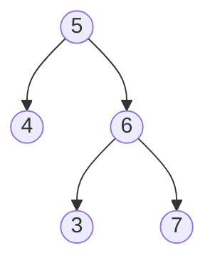
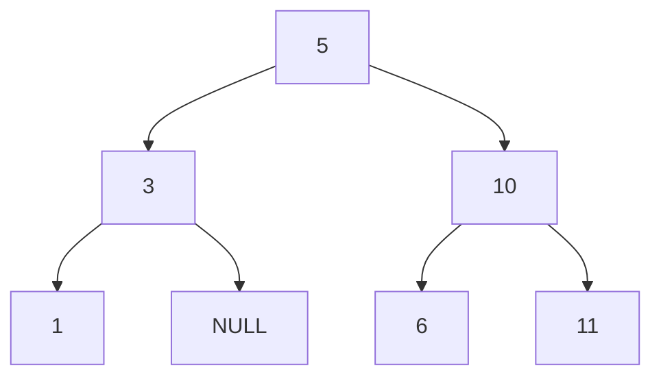

## 链接

[654.最大二叉树](https://programmercarl.com/0654.%E6%9C%80%E5%A4%A7%E4%BA%8C%E5%8F%89%E6%A0%91.html)

[617.合并二叉树](https://programmercarl.com/0617.%E5%90%88%E5%B9%B6%E4%BA%8C%E5%8F%89%E6%A0%91.html)

[700.二叉搜索树中的搜索](https://programmercarl.com/0700.%E4%BA%8C%E5%8F%89%E6%90%9C%E7%B4%A2%E6%A0%91%E4%B8%AD%E7%9A%84%E6%90%9C%E7%B4%A2.html)

[98.验证二叉搜索树](https://programmercarl.com/0098.%E9%AA%8C%E8%AF%81%E4%BA%8C%E5%8F%89%E6%90%9C%E7%B4%A2%E6%A0%91.html)

## 知识
### 700.二叉搜索树中的搜索

**什么是二叉树搜索树？**其根节点要比左子树里所有节点的数值大，根节点要比右子树里所有节点的数值小。同理，左右子树也符合这个规则。二叉搜索树的上述规则确定了遍历顺序（既不是前序，也不是中序、后序），而二叉搜素树的上述规则也让本题的迭代写法特别简单。

`if (node != NULL)` 可以简写为`if (node)`。

### 98.验证二叉搜索树

中序遍历一棵二叉搜索树，得到的数组中的元素是有序的。

## 初次尝试
### 654.最大二叉树

本题延续106.从中序与后序遍历序列构造二叉树的思路。步骤可以分为：

1. 找到nums数组中的最大值，作为root

2. 找到root在nums中的下标

3. 将nums按照root分为左数组和右数组

4. 递归处理左数组和右数组，得到左右子树

我独立写出了以下的代码:

```c++
class Solution {
public:
    TreeNode* traversal(vector<int>& nums)
    {
        // 终止条件：数组为空，构造不出树，返回NULL
        if (nums.size() == 0) return NULL;
        
        // 找到nums数组中的最大值，作为root
        int max = -1;
        for (int i = 0; i < nums.size(); i ++ )
        {
            if (nums[i] > max)
            {
                max = nums[i];
            }
        }
        
        // 找到root在nums中的下标
        int j = 0;
        for (j; j < nums.size(); j ++ ) 
            if (nums[j] == max)
                break;
        
        int rootvalue = nums[j];
        TreeNode* root = new TreeNode(rootvalue);

        // 数组分为左数组和右数组
        vector<int> ml(nums.begin(), nums.begin() + j);
        vector<int> mr(nums.begin() + j + 1, nums.end());
        
        // 递归处理左数组和右数组，得到左右子树
        root->left = traversal(ml);
        root->right = traversal(mr);
        return root;
    }

    TreeNode* constructMaximumBinaryTree(vector<int>& nums) {
        if (nums.size() == 0) return NULL;
        else return traversal(nums);
    }
};
```

### 617.合并二叉树

对于本题，我也采用前序遍历的方法，独立写出了以下的代码：
```cpp
class Solution {
public:
    TreeNode* mergeTrees(TreeNode* root1, TreeNode* root2) {
        // 应该采用前序遍历，先中节点，再左节点，再右节点
        // 终止条件
        if (root1 == NULL && root2 == NULL) return NULL;
        else if (root1 == NULL) return root2;
        else if (root2 == NULL) return root1;

        int rootvalue = root1->val + root2->val;
        TreeNode* root = new TreeNode(rootvalue);

        // 左节点
        if (root1->left != NULL && root2->left != NULL)
            root->left = mergeTrees(root1->left, root2->left);
        else if (root1->left != NULL)
            root->left = mergeTrees(root1->left, NULL);
        else if (root2->left != NULL)
            root->left = mergeTrees(NULL, root2->left);
        
        // 右节点
        if (root1->right != NULL && root2->right != NULL)
            root->right = mergeTrees(root1->right, root2->right);
        else if (root1->right != NULL)
            root->right = mergeTrees(root1->right, NULL);
        else if (root2->right != NULL)
            root->right = mergeTrees(NULL, root2->right);

        return root; 
    }
};
```

由上述代码可知，对左右节点的处理都分了三类讨论，这与终止条件中的三类相对应，这是上述代码可以正确运行的基础。本题应该也可以用层序遍历去做。

### 700.二叉搜索树中的搜索

哈哈哈这题又给我用前序遍历的写法做出来了。
```cpp
class Solution {
public:
    TreeNode* searchBST(TreeNode* root, int val) {
        // 终止条件
        if (root == NULL) return NULL;

        // 前序遍历搜索整棵树
        if (root->val == val) return root; // 中节点
        TreeNode* left = searchBST(root->left, val); // 左节点：在左子树中搜索值为val的节点
        TreeNode* right = searchBST(root->right, val); // 右节点：在右子树中搜索值为val的节点

        if (left != NULL && right == NULL) return left; // 在左子树中找到目标节点，则返回之
        else if (left == NULL && right != NULL) return right; // 在右子树中找到目标节点，则返回之
        return NULL; // 左右子树中都没找到，则返回空
    }
};
```

本题用层序遍历应该也可以做。层序遍历的写法我也独立写出来了：
```cpp
class Solution {
public:
    TreeNode* searchBST(TreeNode* root, int val) {
        if (root == NULL) return NULL;

        queue<TreeNode*> q;
        q.push(root);

        while (q.size())
        {
            TreeNode* node = q.front(); q.pop(); // 取出一个节点
            if (node->val == val) return node; // 判断其是否为目标节点，是，则返回之
            
            // 继续往队列中加入当前节点的非空左右子节点
            if (node->left) q.push(node->left); 
            if (node->right) q.push(node->right);
        }
        
        // 若最后没有找到目标节点，则返回空
        return NULL;
    }
};
```

### 98.验证二叉搜索树

本题我觉得应该采用中序遍历，先验证左子树是否符合要求，再验证中节点是否符合要求，最后验证右子树是否符合要求，根据这个思路，我尝试独立写出本题的代码。
```cpp
class Solution {
public:
    bool isValidBST(TreeNode* root) {
        // 只有root节点
        if (root->left == NULL && root->right == NULL) return true;
        // 左子树为空
        else if (root->left == NULL)
        {
            if (root->val >= root->right->val) return false;
            else return isValidBST(root->right);
        }
        // 右子树为空
        else if (root->right == NULL) 
        {
            if (root->val <= root->left->val) return false;
            else return isValidBST(root->left);
        }
        // 左右子树都不为空
        else
        {
            if (root->val <= root->left->val || root->val >= root->right->val) return false;
            else
            {
                bool res1 = isValidBST(root->left);
                bool res2 = isValidBST(root->right);
                if (res1 && res2) return true;
                else return false;
            }
        }
    }
};
```

上述代码分了4种情况讨论：只有root节点；左子树为空；右子树为空；左右子树都不为空。但忽略了一种情况：
当`root = [5,4,6,null,null,3,7]`时，二叉树如下所示：



此时虽然[5, 4, 6]是二叉搜索树，[6, 3, 7]也是二叉搜素树，但[6, 3, 7]中存在元素3小于root的5，因此整体并不是一棵二叉搜索树。这种局部都是二叉搜索树，但整体不是二叉搜索树的情况，在我的代码中并没有进行特判。因此我只能通过77/85个测试样例。这也是本题的坑之所在。直接看卡尔的讲解。

## 实现
### 654.最大二叉树

规则：在数组中选取最大的元素作为root，最大元素的左区间用于构造左子树，规则同上；最大元素的右区间用于构造右子树，规则同上。

例如，321605，根据以上规则得到以下的最大二叉树：


遍历方式：前序遍历。**凡是涉及构造二叉树的题目，都要用到前序遍历**。原因：前序遍历顺序是中左右，先构造root节点，再去构造左子树和右子树。

代码实现：
```cpp
// 返回二叉树的root节点
TreeNode* construct(vector<int>& nums)
{
    // 确定递归的终止条件
    // 数组中只有一个元素，则唯一一个元素就是root节点
    // 本题题目中对数组的要求是非空，因此不需要考虑数组为空的情况
    if (nums.size() == 1) 
        return new TreeNode(nums[0]);
    
    // 单层递归的逻辑
    // 中节点的逻辑
    // 找到数组中的最大值和其下标
    int maxvalue = 0;
    int index = 0;
    for (int i = 0; i < nums.size(); i ++ )
        if (nums[i] > maxvalue)
        {
            maxvalue = nums[i];
            index = i;
        }
    
    // 根据最大值定义root节点
    TreeNode* root = new TreeNode(maxvalue);
    
    // 左子树的逻辑
    // 根据index切割原数组，将其分为左右数组
    if (index > 0) // 保证左区间中至少有一个元素
    {
        vector<int> l(nums.begin(), nums.begin() + index); // 左区间，左闭右开
        root->left = construct(l); // 递归构造左子树
    }
    
    // 右子树的逻辑
    if (index < nums.size() - 1) // 保证右区间中至少有一个元素
    {
        vector<int> r(nums.begin() + index + 1, nums.end()); // 右区间，左闭右开
        root->right = construct(r); // 递归构造右子树
    }
    
    return root;
}
```

上述代码严格按照前序遍历构造二叉树。本代码冗余，且效率低，效率低的原因是每次分割时都构造了两个新的数组。**对本代码的优化是每次分割数组时不用构造新的数组，操作下标即可**。

还有一个重要问题：左右子树的逻辑中要加上if判断。写不写if关键在于终止条件。终止条件保证了数组中至少要有一个元素，因此在左右子树的逻辑中需要加上if判断，也就是保证左右区间中至少有一个元素。当然在左右子树的逻辑中不写if也可以，那就需要在leetcode的主函数外另写一个函数。

完整的代码如下所示：
```cpp
class Solution {
public:
    TreeNode* constructMaximumBinaryTree(vector<int>& nums) {
        // 终止条件
        if (nums.size() == 1)
            return new TreeNode(nums[0]);

        // 前序遍历：中节点
        // 找到root的值和下标
        int max = 0, index = 0;
        for (int i = 0; i < nums.size(); i ++ )
            if (nums[i] > max)
            {
                max = nums[i];
                index = i;
            }
        TreeNode* root = new TreeNode(max);

        // 左节点
        if (index > 0)
        {
            vector<int> l(nums.begin(), nums.begin() + index); // 左区间
            root->left = constructMaximumBinaryTree(l); // 递归构造左子树
        }

        // 右节点
        if (index < nums.size() - 1)
        {
            vector<int> r(nums.begin() + index + 1, nums.end()); // 右区间
            root->right = constructMaximumBinaryTree(r); // 递归构造右子树
        }
        return root;
    }
};
```

左右子树中不加if判断的写法（关键在于终止条件`nums.size() == 0`），这也是我在初次尝试中的写法，是最不容易写错的写法。因为思路直接继承自106.从中序与后序遍历序列构造二叉树，且不需要在左右子树处加if判断。**推荐这个写法**：
```cpp
class Solution {
public:
    TreeNode* construct(vector<int>& nums) {
        // 终止条件
        if (nums.size() == 0)
            return NULL;

        // 前序遍历：中节点
        // 找到root的值和下标
        int max = 0, index = 0;
        for (int i = 0; i < nums.size(); i ++ )
            if (nums[i] > max)
            {
                max = nums[i];
                index = i;
            }
        TreeNode* root = new TreeNode(max);

        vector<int> l(nums.begin(), nums.begin() + index); // 左区间
        vector<int> r(nums.begin() + index + 1, nums.end()); // 右区间
        root->left = construct(l); // 递归构造左子树
        root->right = construct(r); // 递归构造右子树
        
        return root;
    }

    TreeNode* constructMaximumBinaryTree(vector<int>& nums) {
        if (nums.size() == 0) return NULL;
        else return construct(nums);
    }
};
```

在本写法的基础上进一步进行优化。不在分割数组时创建新的数组，只改变数组的下标。
```cpp
class Solution {
public:
    TreeNode* construct(vector<int>& nums, int begin, int end) {
        // 终止条件，区间是左闭右开的，因此是begin >= end
        if (begin >= end)
            return NULL;

        // 全部操作下标，不需要操作元素的值
        int index = begin;
        // 从begin + 1开始搜索，i = begin时，index = i = begin，不需要写入循环
        for (int i = begin + 1; i < end; i ++ ) 
            if (nums[i] > nums[index])
                index = i;
        TreeNode* root = new TreeNode(nums[index]);

        // 左节点
        // 左闭右开
        int leftbegin = begin;
        int leftend = index;
        root->left = construct(nums, leftbegin, leftend); // 递归构造左子树

        // 右节点
        int rightbegin = index + 1;
        int rightend = end;
        root->right = construct(nums, rightbegin, rightend); // 递归构造右子树
        
        return root;
    }

    TreeNode* constructMaximumBinaryTree(vector<int>& nums) {
        // 不需要下面这句话，因为已经在construct函数中通过begin == end处理了nums.size() == 0的情况
        // if (nums.size() == 0) return NULL;
        else return construct(nums, 0, nums.size());
    }
};
```

本版本代码在处理左右节点时不需要进行if判断，原因是若左右区间为空，在递归调用construct函数时会因为`begin == end`直接返回`NULL`，而不会出现直接创建数组写法中的空数组的现象（终止条件中未考虑空数组的情况，因此若数组为空不能触发终止条件，会导致程序报错）。因此我也可以在终止条件中考虑空数组的情况，而不在构建左右子树时加上if判断，代码如下所示：
```cpp
class Solution {
public:
    TreeNode* constructMaximumBinaryTree(vector<int>& nums) {
        // 终止条件1
        if (nums.size() == 0) return NULL;
        
        // 终止条件2
        if (nums.size() == 1) return new TreeNode(nums[0]);

        // 前序遍历：中节点
        // 找到root的值和下标
        int max = 0, index = 0;
        for (int i = 0; i < nums.size(); i ++ )
            if (nums[i] > max)
            {
                max = nums[i];
                index = i;
            }
        TreeNode* root = new TreeNode(max);

        // 左节点，不需加if判断，由于有终止条件1
        vector<int> l(nums.begin(), nums.begin() + index); // 左区间
        root->left = constructMaximumBinaryTree(l); // 递归构造左子树

        // 右节点，不需加if判断，由于有终止条件1
        vector<int> r(nums.begin() + index + 1, nums.end()); // 右区间
        root->right = constructMaximumBinaryTree(r); // 递归构造右子树
        return root;
    }
};
```

### 617.合并二叉树

将两个二叉树合并为一个二叉树。有相同的节点则将两个节点数值相加，作为新节点。对于一棵树上有而另一棵树上没有的节点，将新的节点补充过来。难点：同时操作两个二叉树。本题使用前序遍历最易理解，顺序是中左右。中序和后序也可，但不太符合直观上合并两棵二叉树的过程。本题也可使用迭代法。接下来写递归的代码：
```cpp
TreeNode* mergeTree(TreeNode* t1, TreeNode* t2)
{
    // 终止条件
    // 遍历到t1树的某个位置为空后，需要返回t2树上相同位置的节点（遍历两树是同步的），这样才能将t2树上的该节点的子树加入到合并后的二叉树中
    // 已经包含了两树都为空的情况
    if (t1 == NULL) return t2;
    if (t2 == NULL) return t1;
    
    // 单层递归逻辑，前序遍历
    // 直接改tree1的结构，而不重新定义一棵二叉树
    t1->val += t2->val; // 中节点
    t1->left = mergeTree(t1->left, t2->left); // 左节点
    t1->right = mergeTree(t1->right, t2->right); // 右节点
    
    return t1; // 返回合并后的二叉树，即t1
}
```

本题采用中序/后序遍历也可以，把单层递归逻辑的三行代码调整顺序即可。按照前序遍历的思路想即可，这符合我们正常合并二叉树的习惯。本题除了在t1上修改，也可以定义一棵新的二叉树，写法如下：
```cpp
TreeNode* root = new TreeNode(0);

root->val = t1->val + t2->val;
root->left = mergeTree(t1->left, t2->left);
root->right = mergeTree(t1->right, t2->right);

return root;
```

上述写法空间复杂度是O(n)。

本题的迭代写法如下所示：
```cpp
// 迭代写法
class Solution {
public:
    TreeNode* mergeTrees(TreeNode* r1, TreeNode* r2) {
        // 终止条件
        if (r1 == NULL) return r2;
        if (r2 == NULL) return r1;

        // 迭代写法，常用队列
        queue<TreeNode*> q;
        q.push(r1); q.push(r2);

        while (q.size())
        {
            TreeNode* n1 = q.front(); q.pop();
            TreeNode* n2 = q.front(); q.pop();

            // n1和n2都不为空
            n1->val += n2->val;

            // 若n1和n2的左子树都不为空，则将它们加入队列中
            if (n1->left != NULL && n2->left != NULL)
            {
                q.push(n1->left);
                q.push(n2->left);
            }

            // 若n1和n2的右子树都不为空，则将它们加入队列中
            if (n1->right != NULL && n2->right != NULL)
            {
                q.push(n1->right);
                q.push(n2->right);
            }

            // 若n1的左子树为空，则将n2的左子树赋到n1上
            if (n1->left == NULL)
                n1->left = n2->left;
            
            // 若n1的右子树为空，则将n2的右子树赋到n1上
            if (n1->right == NULL)
                n1->right = n2->right;
        }
        return r1;
    }
};
```

### 700.二叉搜索树中的搜索

在二叉树中找到数值为目标值的节点然后返回。

**什么是二叉树搜索树？**其根节点要比左子树里所有节点的数值大，根节点要比右子树里所有节点的数值小。同理，左右子树也符合这个规则。二叉搜索树的上述规则确定了遍历顺序，而二叉搜素树的上述规则也让本题的迭代写法特别简单。递归法的代码如下所示：

```cpp
TreeNode* search(TreeNode* root, int val)
{
    // 两个终止条件
    if (root == NULL || root->val == val) return root; 
    
    // 单层递归的逻辑
    TreeNode* res = NULL; // res用于存递归函数的返回值
    
    // 根据二叉搜索树的特性，若val < root的值，则向root的左子树中去遍历
    if (val < root->val) res = search(root->left, val);
    // 根据二叉搜索树的特性，若val > root的值，则向root的右子树中去遍历
    if (val > root->val) res = search(root->right, val);
    
    return res;
}
```

相比于我在初次尝试中的写法，上述写法代码更简洁，效率也更高。因为我在初次尝试中的写法没有利用二叉搜索树的特性，只是单纯地先搜索root节点，再递归搜索root节点的左子树和右子树。而卡尔的写法先搜索root节点，然后根据`root->val`和`val`的大小对比，决定是在root节点的左子树中继续搜索还是在其右子树中继续搜索。卡尔的写法并不涉及前中后序，因为二叉搜索树本身的性质已经帮我们确定了遍历的顺序。

本题迭代法的代码也并很简单。
```cpp
TreeNode* search(TreeNode* root, int val)
{
    while (root != NULL)
    {
        // 向左子树中搜索
        if (val < root->val) root = root->left;
        // 向右子树中搜索
        else if (val > root->val) root = root->right;
        // 相等，说明找到了目标节点
        else return root;
    }
    return NULL; // 树中无目标节点，则返回空
}
```

迭代法中搜索的方向也由二叉搜索树的特性决定。上述迭代写法也比我在初次尝试中写的迭代写法更为简洁且效率更高，因为卡尔**充分利用了二叉搜索树的特性**，知道想要找到目标值应该朝着什么方向走。

### 98.验证二叉搜索树

判断给定的二叉树是否是二叉搜索树。二叉搜索树的定义：左子树中的所有元素都小于root节点，右子树中的所有元素都大于root节点，左右子树都符合这个规则。**中序遍历这棵二叉树，其元素是有序的**。例如对以下二叉树：


按照中序遍历，就是[1, 3, 5, 6, 10, 11]，数组是有序的。**验证二叉树是否是二叉搜索树，就是验证中序遍历后得到的数组是否是单调递增的**。开始写具体的代码：
```cpp
bool isvalid(TreeNode* root)
{
    if (root == NULL) return true; // 空二叉树是二叉搜索树
    
    vector<int> vec; // 存放树中序遍历后的结果
    
    // 中序遍历
    isvalid(root->left); // 左
    vec.push_back(root->val); // 中：将遍历到的元素放入数组中
    isvalid(root->right); // 右
    
    // 判断vec是否有序
}
```

根据上述思路，我写下了能够运行的代码：
```cpp
class Solution {
public:
    vector<int> vec; // 全局变量，用于存放中序遍历二叉树的结果
    
    // 用于中序遍历二叉树的辅助函数
    void inorder(TreeNode* root)
    {
        if (root == NULL) return;
        inorder(root->left);
        vec.push_back(root->val);
        inorder(root->right);
    }

    bool isValidBST(TreeNode* root) {
        if (root == NULL) return true;

        inorder(root);
        
        // 判断数组是否是单调递增的
        for (int i = 0; i < vec.size() - 1; i ++ )
        {
            if (vec[i + 1] <= vec[i]) return false;
        }
        return true;
    }
};
```

其实不需要将二叉树转换为数组，可以直接在遍历二叉树的过程中判断元素是否是单调递增的。接下来看如何不使用数组来判断二叉树是否是二叉搜索树。本题也可以用迭代法实现，但主要关注递归法。

代码误区：`if (root->val > root->left->val && root->val < root->right->val) return true;`。实际上这样写是错误的。因为二叉搜索树要求的是root要大于左子树中的所有值，root要小于右子树中的所有值。这个错误我在初次尝试部分已经讨论过了。

现在开始写不额外定义数组的写法：
```cpp
// -2^31 <= Node.val <= 2^31 - 1，因此maxval要小于int的最小值，因此maxval要取为long long的最小值
long long maxval = LONG_MIN; 

bool isvalid(TreeNode* root)
{
    if (root == NULL) return true;
    bool left = isvalid(root->left); // 左：左子树是否是二叉搜索树
    
    // 中
    // 若二叉树是二叉搜索树，在中序遍历的情况下，元素是递增的，root->val会持续大于maxval
    // maxval相当于记录了遍历过程中当前节点的前一个节点的数值
    if (root->val > maxval)
    {
        maxval = root->val; // 更新maxval
    }
    // 若元素不是递增的，则return false
    else return false;
    
    // 右：右子树是否是二叉搜索树
    bool right = isvalid(root->right);
    
    return left && right; // 要求左右子树同时符合条件
}
```

以二叉树为例：


在判断6是否合法时，拿5（root，也是maxvalue）和6进行比较了，因此不会进入初次尝试中提到的误区。若左叶子为`INT_MIN`，且`maxval = INT_MIN`，则`root->val == maxval`，就会直接返回false。因此要让`maxval`小于`INT_MIN`。

上述方法存在问题，若左叶子为`LONG_MIN`（改变输入节点数值的范围），则`maxval`就无法取更小的值了。我们可以对上述方法进行优化，**不额外定义一个变量，而是直接让二叉树的前一个节点和后一个节点进行比较**。写下如下代码：
```cpp
TreeNode* pre = NULL; // pre记录当前节点的前一个节点, root可以和pre进行比较

bool isvalid(TreeNode* root)
{
    if (root == NULL) return true;
    
    bool left = isvalid(root->left); // 左
    // 中
    if (pre != NULL && pre->val >= root->val) return false; // 前一个节点的值大于当前节点，则return false
    pre = root; // 将pre从NULL移到root，即从前一个节点移到当前节点
    bool right = isvalid(root->right); // 右
    
    return left && right;
}
```

以上方法被称为双指针优化。其实原理非常简单，就是在中序遍历的过程中一直去判断root（当前节点）和pre（前一个节点）之间的大小关系。root指针是由中序遍历的过程去移动的，pre指针是通过直接赋值去移动的。本题是二叉搜索树中的基础题。

## 心得与备忘录

### 654.最大二叉树

1. 本题的思路和106.从中序与后序遍历序列构造二叉树的思路非常类似，理解了那题就可以顺畅的写出本题的代码。

2. 本题的单层递归核心逻辑如下：
   1. 找到nums数组中的最大值，作为root

   2. 找到root在nums中的下标

   3. 将nums按照root分为左数组和右数组

   4. 递归处理左数组和右数组，得到左右子树

3. 本题的终止条件可以写两个也可以写一个。若只有终止条件：`if (nums.size() == 1) return new TreeNode(nums[0]);`，则需要在构造左右子树时加上if判断，保证左右区间不为空。若再加上终止条件：`if (nums.size() == 0) return NULL;`，则就不需要在构造左右子树时加上if判断了。加上第二个终止条件的原因并非是为了防止传入的nums数组为空（题目限制了传入的数组中至少有1个元素），而是为了在递归时出现数组为空的情况下顺利退出递归过程。

4. 在实现中，给出了本题的4种写法。写法1和写法4的区别在于：1有1个终止条件，有if判断。4有2个终止条件，无if判断。**最推荐的写法**（初学者不易写错，且可直接由106演化而来）**是写法2**。效率最高的写法是写法3（只操作数组下标，而不新建数组，也不操作数组中的元素）。我将在下面附上写法2的代码。
   ```cpp
   class Solution {
   public:
       TreeNode* construct(vector<int>& nums) {
           // 终止条件
           if (nums.size() == 0)
               return NULL;
   
           // 找到root的值和下标
           int max = 0, index = 0;
           for (int i = 0; i < nums.size(); i ++ )
               if (nums[i] > max)
               {
                   max = nums[i];
                   index = i;
               }
           TreeNode* root = new TreeNode(max);
   
           vector<int> l(nums.begin(), nums.begin() + index); // 左区间
           vector<int> r(nums.begin() + index + 1, nums.end()); // 右区间
           root->left = construct(l); // 递归构造左子树
           root->right = construct(r); // 递归构造右子树
           
           return root;
       }
   
       TreeNode* constructMaximumBinaryTree(vector<int>& nums) {
           if (nums.size() == 0) return NULL;
           else return construct(nums);
       }
   };
   ```

5. 本题的优化写法是只操作下标，不新建数组，也不操作数组中元素的值。这样可以降低时间和空间复杂度（我感觉时间复杂度基本没变，但空间复杂度由于不需要新建数组，大大降低了）。注意区间始终要保持左闭右开（基于循环不变量原则）。

### 617.合并二叉树

1. 本题虽然涉及到同时操作两棵二叉树，但代码的思路和实现都非常简单。
2. 本题的递归写法的思路：
   - 终止条件：若一棵树的root节点为空，则返回另一棵树的root节点
   - 单层递归：前序遍历。先合并中节点的值，然后再递归处理左子树和右子树。在树1的基础上，将树1修改为合并后的树。也可定义一棵新的树作为合并后的树。
3. 本题的迭代写法较为复杂，没必要掌握。

### 700.二叉搜索树中的搜索

1. 通过本题可以了解二叉搜索树的性质：其根节点要比左子树里所有节点的数值大，根节点要比右子树里所有节点的数值小。同理，左右子树也符合这个规则。二叉搜索树的上述规则确定了遍历顺序（既不是前序，也不是中序、后序），而二叉搜素树的上述规则也让本题的迭代写法特别简单。
2. 我在初次尝试中的递归写法和迭代写法并没有利用二叉搜索树的性质，因此代码较长且运行效率较低，相当于初次尝试中的代码是执行了在一般的二叉树中搜索节点的过程。而在实现中卡尔的递归写法和迭代写法则充分利用了二叉搜索树的性质，因此代码较为简洁且运行效率高。
3. 本题的迭代写法尤其简单，原因是：一般二叉树遍历的迭代法，需要使用栈来模拟深度遍历，使用队列来模拟广度遍历。但对于二叉搜索树，因为二叉搜索树的特殊性，也就是节点的有序性，可以不使用辅助栈或者队列就可以写出迭代法。对于一般二叉树，递归过程中还有回溯的过程，例如走一个左方向的分支走到头了，那么要调头，在走右分支。而**对于二叉搜索树，不需要回溯的过程，因为节点的有序性就帮我们确定了搜索的方向。**
4. 本题推荐的写法是卡尔的写法，因为充分利用了二叉搜索树的性质。但如果想不起来卡尔的写法，或者题目中的二叉树并非二叉搜索树，而是一般的二叉树，我在初次尝试中的两种写法不失为一种具有普适性的写法。

### 98.验证二叉搜索树

1. 本题的递归解法有三个版本，分别是直接判断中序遍历得到的数组是否递增、`maxvalue`法和双指针法。其中最简单最直观的方法是方法1，但其也是效率最低的。因此一定要掌握方法1，接着尽力掌握方法3，最后掌握方法2即可。
2. **本题利用的基本原理：中序遍历一棵二叉搜索树，得到的数组中的元素是有序（递增）的**。
3. `maxvalue`法和双指针法本质都是在中序遍历二叉树的过程中，不用额外的数组去存储二叉树中的所有元素，而是直接判断当前节点是否大于前一个节点。但`maxvalue`法具有`maxvalue`的初始值必须小于节点的最小值的问题，因此若节点的最小值可以取到long long的最小值，则`maxvalue`的初始值无法确定（cpp不提供超出long long范围的整数类型）。**因此双指针法更为完美**。
4. `maxvalue`法和双指针法在代码实现上略有区别。二者的单层递归逻辑都是中序遍历，但在对中节点的处理逻辑上有差异。`maxvalue`法是当元素递增时，更新`maxvalue`的值，否则返回false。双指针法则是当元素不是递增时，返回false，否则更新pre指针。
5. 本题的迭代解法要用到栈，代码也比较复杂，不要求掌握。
